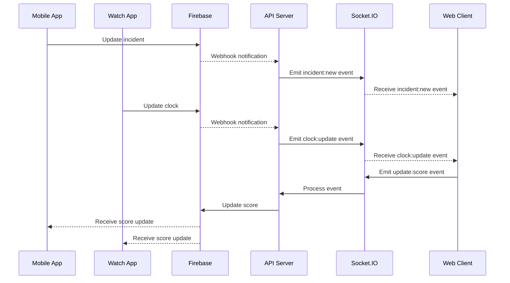

# Realtime Features

## Real-time Integration

The Refereezy platform provides real-time functionality through a combination of Firebase Realtime Database and Socket.IO integration. This document details how to work with these real-time features.

## Firebase Realtime Database

Refereezy uses Firebase for real-time synchronization of match data, reports, and incidents across devices.

### Data Structure

The Firebase database is structured as follows:

```
refereezy/
|-- matches/
|   |-- {match_id}/
|       |-- status: "in_progress"
|       |-- current_time: "00:15:30"
|       |-- period: 1
|       |-- score: {home: 2, away: 1}
|       |-- incidents/
|           |-- {incident_id}/
|               |-- type: "goal"
|               |-- time: "00:10:15"
|               |-- team: "home"
|               |-- player_id: "player123"
|
|-- clocks/
|   |-- {clock_code}/
|       |-- match_id: "match123"
|       |-- is_running: true
|       |-- current_time: "00:15:30"
|       |-- period: 1
|       |-- connected_devices: ["device1", "device2"]
|
|-- reports/
|   |-- {report_id}/
|       |-- match_id: "match123"
|       |-- status: "in_progress"
|       |-- referee_id: "ref123"
|       |-- incidents: [...]
```

### Real-time Listeners

To listen for real-time updates, use Firebase listeners:

```javascript
// Web application example
import { getDatabase, ref, onValue } from "firebase/database";

const db = getDatabase();
const matchRef = ref(db, `matches/${matchId}`);

onValue(matchRef, (snapshot) => {
  const data = snapshot.val();
  updateMatchUI(data);
});
```

```kotlin
// Android example
val database = FirebaseDatabase.getInstance()
val matchRef = database.getReference("matches").child(matchId)

matchRef.addValueEventListener(object : ValueEventListener {
    override fun onDataChange(snapshot: DataSnapshot) {
        val matchData = snapshot.getValue(Match::class.java)
        updateMatchUI(matchData)
    }
    
    override fun onCancelled(error: DatabaseError) {
        Log.e("Firebase", "Error: ${error.message}")
    }
})
```

### Writing Real-time Data

To update data in real-time:

```javascript
// Web application example
import { getDatabase, ref, update } from "firebase/database";

const db = getDatabase();
const matchRef = ref(db, `matches/${matchId}`);

// Update score
update(matchRef, {
  "score/home": 3,
  "current_time": "00:25:45"
});

// Add a new incident
const incidentsRef = ref(db, `matches/${matchId}/incidents`);
const newIncidentRef = push(incidentsRef);
set(newIncidentRef, {
  type: "goal",
  time: "00:25:45",
  team: "home",
  player_id: "player123"
});
```

## Socket.IO Integration

For specific real-time features, especially for browser clients, Refereezy uses Socket.IO:

### Connection Setup

```javascript
// Client-side connection
import { io } from "socket.io-client";

const socket = io("https://api.refereezy.com", {
  path: "/socket",
  auth: {
    token: "user-authentication-token"
  }
});

socket.on("connect", () => {
  console.log("Connected to Refereezy real-time server");
});

socket.on("disconnect", (reason) => {
  console.log("Disconnected:", reason);
});
```

### Available Events

#### Client to Server Events

| Event | Description | Payload |
|-------|-------------|---------|
| `join:match` | Join a match room | `{ matchId: "match123" }` |
| `leave:match` | Leave a match room | `{ matchId: "match123" }` |
| `update:score` | Update match score | `{ matchId: "match123", homeScore: 2, awayScore: 1 }` |
| `add:incident` | Add a match incident | `{ matchId: "match123", incident: {...} }` |
| `update:clock` | Update match clock | `{ matchId: "match123", time: "00:15:30", running: true }` |

#### Server to Client Events

| Event | Description | Payload |
|-------|-------------|---------|
| `match:update` | Match data updated | `{ matchId: "match123", ...matchData }` |
| `score:update` | Score updated | `{ matchId: "match123", homeScore: 2, awayScore: 1 }` |
| `incident:new` | New incident added | `{ matchId: "match123", incident: {...} }` |
| `clock:update` | Clock state updated | `{ matchId: "match123", time: "00:15:30", running: true }` |
| `report:update` | Report updated | `{ reportId: "report123", status: "completed" }` |

### Example: Real-time Match Updates

```javascript
// Join a match room
socket.emit("join:match", { matchId: "match123" });

// Listen for score updates
socket.on("score:update", (data) => {
  console.log(`Score updated: ${data.homeScore} - ${data.awayScore}`);
  updateScoreUI(data.homeScore, data.awayScore);
});

// Listen for new incidents
socket.on("incident:new", (data) => {
  console.log("New incident:", data.incident);
  addIncidentToUI(data.incident);
});

// Listen for clock updates
socket.on("clock:update", (data) => {
  console.log(`Clock: ${data.time}, Running: ${data.running}`);
  updateClockUI(data.time, data.running);
});
```

## Hybrid Approach

Refereezy uses a hybrid approach for real-time features:

1. **Firebase Realtime Database**
   - Primary storage for real-time data
   - Used by mobile and watch applications
   - Provides offline capabilities
   - Handles authentication and security rules

2. **Socket.IO**
   - Used for web clients for faster updates
   - Optimized for browser environments
   - Provides additional real-time features not easily implemented with Firebase

### Synchronization Between Systems

The Refereezy API server ensures synchronization between Firebase and Socket.IO:



## Offline Support

### Mobile and Watch Applications

Firebase provides offline capabilities:

```kotlin
// Android example
FirebaseDatabase.getInstance().setPersistenceEnabled(true)

// Set cache size
val database = FirebaseDatabase.getInstance()
database.setPersistenceCacheSizeBytes(10 * 1024 * 1024) // 10MB
```

### Web Application

For web clients, implement a custom offline queue:

```javascript
let offlineQueue = [];
let isOnline = navigator.onLine;

window.addEventListener('online', () => {
  isOnline = true;
  processOfflineQueue();
});

window.addEventListener('offline', () => {
  isOnline = false;
});

function processOfflineQueue() {
  if (isOnline && offlineQueue.length > 0) {
    offlineQueue.forEach(item => {
      socket.emit(item.event, item.data);
    });
    offlineQueue = [];
  }
}

function safeEmit(event, data) {
  if (isOnline) {
    socket.emit(event, data);
  } else {
    offlineQueue.push({ event, data });
    // Save to local storage for persistence
    localStorage.setItem('offlineQueue', JSON.stringify(offlineQueue));
  }
}
```

## Security Considerations

### Firebase Security Rules

Implement proper security rules in Firebase:

```
{
  "rules": {
    "matches": {
      "$matchId": {
        // Only authenticated users can read match data
        ".read": "auth != null",
        // Only referees assigned to this match can write
        ".write": "auth != null && root.child('matches').child($matchId).child('referee_id').val() === auth.uid"
      }
    },
    "clocks": {
      "$clockCode": {
        // Only authenticated users can read clock data
        ".read": "auth != null",
        // Only devices that have registered with this clock can write
        ".write": "auth != null && root.child('clocks').child($clockCode).child('connected_devices').child(auth.uid).exists()"
      }
    }
  }
}
```

### Socket.IO Authentication

Secure Socket.IO connections:

```javascript
// Server-side authentication middleware
io.use((socket, next) => {
  const token = socket.handshake.auth.token;
  if (!token) {
    return next(new Error("Authentication error"));
  }
  
  // Verify JWT token
  jwt.verify(token, process.env.JWT_SECRET, (err, decoded) => {
    if (err) {
      return next(new Error("Authentication error"));
    }
    
    // Attach user data to socket
    socket.user = {
      id: decoded.sub,
      role: decoded.role
    };
    next();
  });
});
```

## Performance Optimization

### Selective Updates

Send only changed data to minimize bandwidth:

```javascript
// Instead of sending the entire match object
socket.emit("match:update", { matchId, ...entireMatchObject });

// Send only what changed
socket.emit("match:update", { 
  matchId, 
  score: { home: 2, away: 1 },
  current_time: "00:15:30"
});
```

### Batching Updates

For rapid changes like clock updates, batch multiple changes:

```javascript
// Firebase: Reference to update
const clockRef = ref(db, `clocks/${clockCode}`);

// Batch writer with debounce
let clockUpdates = {};
let updateTimeout = null;

function updateClock(key, value) {
  clockUpdates[key] = value;
  
  if (updateTimeout) {
    clearTimeout(updateTimeout);
  }
  
  updateTimeout = setTimeout(() => {
    update(clockRef, clockUpdates);
    clockUpdates = {};
    updateTimeout = null;
  }, 100); // 100ms debounce
}

// Usage
updateClock("current_time", "00:15:30");
updateClock("period", 2);
// Both will be sent in a single update
```

## Testing Real-time Features

### Manual Testing

1. **Multiple Device Testing**
   - Test synchronization across multiple devices
   - Verify that updates appear within expected timeframes

2. **Network Condition Testing**
   - Test with network throttling
   - Test with intermittent connections
   - Test with offline mode

### Automated Testing

Example Jest test for Socket.IO client:

```javascript
import { io } from "socket.io-client";
import { createServer } from "http";
import { Server } from "socket.io";

describe("Socket.IO Client", () => {
  let clientSocket;
  let serverSocket;
  let httpServer;
  let ioServer;
  
  beforeAll((done) => {
    httpServer = createServer();
    ioServer = new Server(httpServer);
    httpServer.listen(() => {
      const port = httpServer.address().port;
      clientSocket = io(`http://localhost:${port}`);
      ioServer.on("connection", (socket) => {
        serverSocket = socket;
      });
      clientSocket.on("connect", done);
    });
  });
  
  afterAll(() => {
    ioServer.close();
    clientSocket.close();
    httpServer.close();
  });
  
  test("should receive score update", (done) => {
    clientSocket.on("score:update", (data) => {
      expect(data).toEqual({
        matchId: "match123",
        homeScore: 2,
        awayScore: 1
      });
      done();
    });
    
    serverSocket.emit("score:update", {
      matchId: "match123",
      homeScore: 2,
      awayScore: 1
    });
  });
});
```

---

*Note for documentation contributors: Add detailed code examples for all client platforms, including React, React Native, and native Android. Include diagrams showing the data flow between different components of the system. Add troubleshooting sections for common real-time synchronization issues.*
