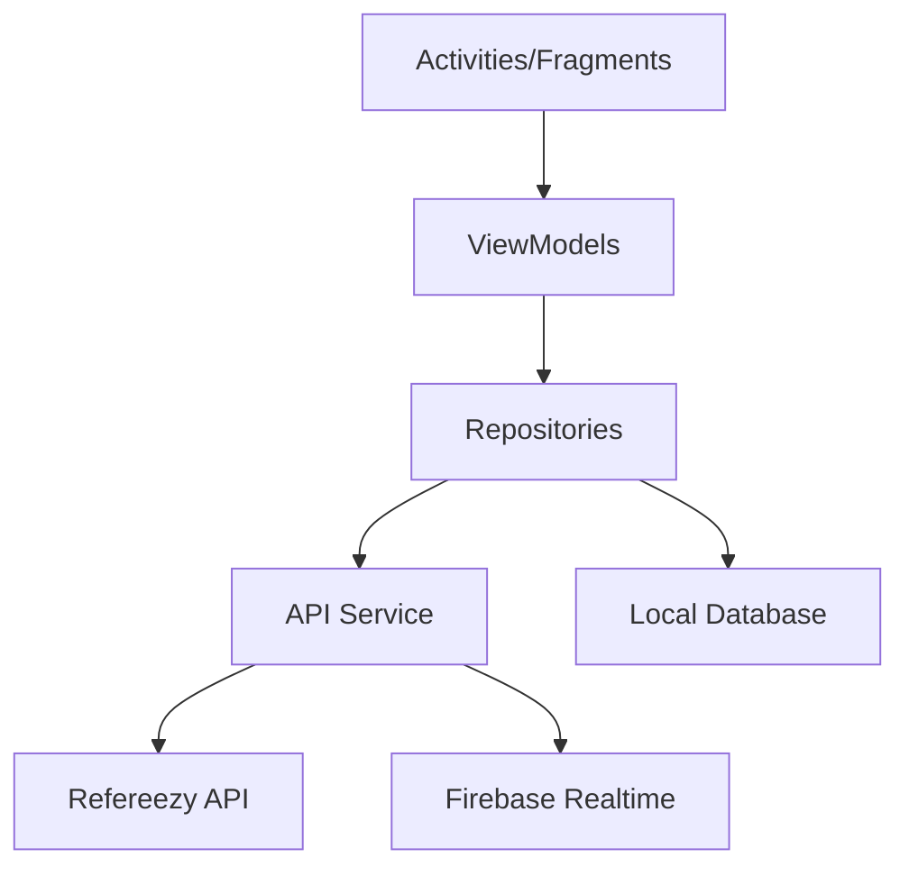

# Technical Documentation

## Refereezy Watch Application Architecture

This document describes the technical architecture and implementation details of the Refereezy Watch Application for Wear OS.

## Technology Stack

- **Language**: Kotlin
- **Platform**: Wear OS (Android)
- **Minimum OS Version**: Wear OS 2.0 (Android 7.1.1)
- **Target Devices**: WearOS smartwatches with compatible hardware

## Architecture Overview

The application follows the MVVM (Model-View-ViewModel) architecture pattern with the following components:



### Core Components

1. **User Interface Layer**
   - Activities and Fragments
   - Custom Views
   - Wear OS specific UI components

2. **ViewModel Layer**
   - ClockViewModel - Manages clock state and synchronization
   - MatchViewModel - Handles match data and state
   - IncidentViewModel - Manages recording and syncing incidents

3. **Repository Layer**
   - ClockRepository - Clock code verification and synchronization
   - MatchRepository - Match data and reports
   - IncidentRepository - Incident recording and management

4. **Data Sources**
   - Network API Service - Communication with Refereezy API
   - Firebase Service - Real-time updates and offline caching
   - Room Database - Local data persistence

## Key Features Implementation

### Clock Synchronization

The watch application synchronizes with the referee's mobile device and the central match clock:

```kotlin
class ClockSynchronizer(private val clockRepository: ClockRepository) {
    // Firebase listener for real-time clock updates
    fun startSynchronization(clockCode: String) {
        // Set up Firebase listeners
        // Handle time synchronization
        // Manage connection state
    }
    
    // Local time keeping when offline
    fun maintainLocalTime() {
        // Use device clock for tracking when disconnected
        // Reconcile differences when connection is restored
    }
}
```

### Incident Recording

The application allows quick recording of match incidents:

```kotlin
class IncidentRecorder(
    private val incidentRepository: IncidentRepository,
    private val clockRepository: ClockRepository
) {
    // Record incidents with current game time
    suspend fun recordIncident(type: IncidentType, teamId: String, playerId: String?) {
        val currentTime = clockRepository.getCurrentGameTime()
        val period = clockRepository.getCurrentPeriod()
        
        val incident = Incident(
            type = type,
            gameTime = currentTime,
            period = period,
            teamId = teamId,
            playerId = playerId,
            timestamp = System.currentTimeMillis()
        )
        
        // Save locally first
        incidentRepository.saveIncidentLocally(incident)
        
        // Then sync to server when possible
        incidentRepository.syncIncident(incident)
    }
}
```

### Offline Support

The watch app provides offline functionality with synchronization when connectivity is restored:

```kotlin
class OfflineManager(
    private val database: AppDatabase,
    private val apiService: ApiService
) {
    // Queue of pending operations when offline
    private val pendingOperations = ConcurrentLinkedQueue<PendingOperation>()
    
    // Monitor network connectivity
    fun monitorConnectivity() {
        // Register connectivity listeners
        // Process pending operations when online
    }
    
    // Process queued operations when online
    suspend fun processPendingOperations() {
        while (pendingOperations.isNotEmpty()) {
            val operation = pendingOperations.poll()
            try {
                // Execute operation against API
                // Remove from local queue if successful
            } catch (e: Exception) {
                // Return to queue if failed
                pendingOperations.add(operation)
                break
            }
        }
    }
}
```

## Data Models

### Clock Data

```kotlin
data class ClockData(
    val clockCode: String,
    val matchId: String,
    val currentTime: String, // Format: "MM:SS"
    val period: Int,
    val isRunning: Boolean,
    val lastSyncTime: Long
)
```

### Incident

```kotlin
data class Incident(
    val id: String = UUID.randomUUID().toString(),
    val type: IncidentType,
    val gameTime: String, // Format: "MM:SS"
    val period: Int,
    val teamId: String,
    val playerId: String? = null,
    val details: String? = null,
    val timestamp: Long = System.currentTimeMillis(),
    var synced: Boolean = false
)

enum class IncidentType {
    GOAL,
    YELLOW_CARD,
    RED_CARD,
    FOUL,
    SUBSTITUTION,
    TIMEOUT,
    GAME_START,
    GAME_END,
    PERIOD_START,
    PERIOD_END,
    OTHER
}
```

## Optimizations

### Battery Usage

The watch application is optimized for battery efficiency:

1. **Adaptive Sync Rate**
   - Reduces synchronization frequency when clock is paused
   - Uses Firebase efficient listeners to minimize updates

2. **Efficient UI Updates**
   - Updates UI components only when necessary
   - Uses efficient layouts designed for Wear OS

3. **Background Processing**
   - Minimizes background work when app is not in foreground
   - Uses WorkManager for deferred processing

### Performance

1. **UI Responsiveness**
   - Offloads processing to background threads
   - Uses coroutines for asynchronous operations
   - Pre-computes UI elements when possible

2. **Memory Management**
   - Limits cached data based on device capabilities
   - Properly releases resources when not in use

## Integration Points

### API Integration

The watch app communicates with the Refereezy API:

```kotlin
interface RefereezyApiService {
    @GET("clock/{clockCode}")
    suspend fun getClockStatus(@Path("clockCode") clockCode: String): ClockResponse
    
    @POST("clock/verify")
    suspend fun verifyClockCode(@Body request: VerifyClockRequest): VerifyClockResponse
    
    @POST("matches/{matchId}/incidents")
    suspend fun recordIncident(
        @Path("matchId") matchId: String,
        @Body incident: IncidentRequest
    ): IncidentResponse
}
```

### Firebase Integration

Real-time updates are handled through Firebase:

```kotlin
class FirebaseManager(private val firestore: FirebaseFirestore) {
    // Listen for clock updates
    fun listenForClockUpdates(clockCode: String, callback: (ClockData) -> Unit) {
        firestore.collection("clocks")
            .document(clockCode)
            .addSnapshotListener { snapshot, error ->
                if (error != null) {
                    // Handle error
                    return@addSnapshotListener
                }
                
                snapshot?.let {
                    val clockData = it.toObject(ClockData::class.java)
                    clockData?.let(callback)
                }
            }
    }
    
    // Record incident in Firebase
    suspend fun recordIncident(matchId: String, incident: Incident) {
        firestore.collection("matches")
            .document(matchId)
            .collection("incidents")
            .document(incident.id)
            .set(incident)
    }
}
```

## Testing

### Unit Tests

Key components are covered by unit tests:

```kotlin
class ClockViewModelTest {
    @Test
    fun `Clock synchronization updates UI state correctly`() {
        // Arrange
        val clockData = ClockData(...)
        val repository = MockClockRepository()
        repository.setClockData(clockData)
        val viewModel = ClockViewModel(repository)
        
        // Act
        viewModel.startSync("TEST123")
        
        // Assert
        assertEquals(clockData.currentTime, viewModel.uiState.value.currentTime)
        assertEquals(clockData.period, viewModel.uiState.value.period)
        assertEquals(clockData.isRunning, viewModel.uiState.value.isRunning)
    }
}
```

### UI Tests

UI interaction tests ensure proper functionality:

```kotlin
class IncidentRecordingTest {
    @Test
    fun `Recording goal shows confirmation and updates list`() {
        // Test UI interaction for recording a goal
    }
}
```

## Known Limitations

1. **Device Compatibility**
   - Some features may not be available on older Wear OS devices
   - Display optimizations are focused on circular displays

2. **Battery Impact**
   - Continuous use during a full match may significantly drain battery
   - Recommended to start with fully charged watch

3. **Network Dependency**
   - Full functionality requires periodic network connectivity
   - Extended offline periods may result in synchronization conflicts

---

*Note for documentation contributors: Add detailed sequence diagrams for the main user flows. Include information about error handling, edge cases, and recovery mechanisms. Document any device-specific adaptations and provide screenshots of the app running on different watch models.*
