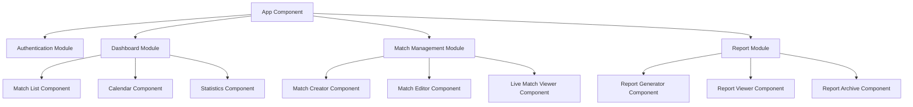

# Web Application Overview

## Introduction

The Refereezy Web Application provides a comprehensive platform for sports match management, real-time match monitoring, and referee report generation. It serves as the central hub for administrators, team managers, and spectators to track matches and access historical data.

The web application is built with modern JavaScript frameworks and follows responsive design principles to ensure compatibility across devices. It integrates with the Refereezy API for data persistence and Firebase for real-time updates.

## Key Features

### Match Management

The web application provides comprehensive match management capabilities:

- **Match Creation**: Create new matches with teams, referees, and venues
- **Match Scheduling**: Schedule matches with date, time, and location
- **Match Groups**: Organize matches into tournaments, leagues, or other groups
- **Team Management**: Create and manage teams and player rosters
- **Referee Assignment**: Assign referees to matches and monitor their availability

Example of the match creation interface:


### Real-time Match Tracking

During live matches, the web application offers:

- **Live Scoreboard**: Real-time score updates
- **Match Clock**: Synchronized match time display
- **Incident Feed**: Live feed of match events (goals, cards, fouls)
- **Team Statistics**: Real-time statistics for teams and players
- **Lineup Visualization**: Visual representation of team formations

### Report Generation and Viewing

After matches conclude, the web application facilitates:

- **Automatic Report Generation**: Creates official match reports from collected data
- **Report Editing**: Allows referees to review and modify reports
- **PDF Export**: Exports reports in PDF format for official documentation
- **Digital Signatures**: Supports digital signing of reports by referees and team representatives
- **Report History**: Maintains an archive of all past match reports

### User Management

The web application provides comprehensive user management:

- **Multi-role Support**: Different access levels for administrators, referees, team managers, and spectators
- **User Profiles**: Personalized profiles with role-specific dashboards
- **Notification System**: In-app and email notifications for important events
- **Activity Logs**: Tracking of user actions for accountability

## Technical Specifications

### Frontend Architecture

The web application is built with:

- **Framework**: Next.js (React)
- **State Management**: Redux
- **Styling**: Tailwind CSS
- **API Communication**: Axios
- **Real-time Updates**: Firebase Realtime Database and Socket.IO

The application follows a component-based architecture:



### API Integration

The web application communicates with the Refereezy API for data operations:

- **RESTful Endpoints**: Standard HTTP methods for CRUD operations
- **JWT Authentication**: Secure token-based authentication
- **Error Handling**: Comprehensive error handling and user feedback

### Real-time Implementation

Real-time features are implemented through:

- **Firebase Listeners**: For match data synchronization
- **Socket.IO**: For low-latency updates and notifications
- **Optimistic UI Updates**: For immediate feedback before server confirmation

Example Firebase integration:

```javascript
// Initialize Firebase match listener
const initializeMatchListener = (matchId) => {
  const matchRef = firebase.database().ref(`matches/${matchId}`);
  
  matchRef.on('value', (snapshot) => {
    const matchData = snapshot.val();
    if (matchData) {
      dispatch(updateMatchData(matchData));
    }
  });
  
  return () => matchRef.off(); // Cleanup function
};
```

### Responsive Design

The web application is designed to be responsive across:

- Desktop browsers
- Tablets
- Mobile phones

This is achieved through:

- Tailwind CSS responsive classes
- Flex and Grid layouts
- Mobile-first approach to UI design
- Device-specific optimizations

## User Interface

### Dashboard

The dashboard provides a personalized overview based on user role:

- **For Administrators**: System statistics, pending approvals, and recent activity
- **For Referees**: Upcoming matches, recent reports, and personal statistics
- **For Team Managers**: Team performance, player statistics, and match schedule
- **For Spectators**: Featured matches, favorite teams, and live events

### Match Viewer

The match viewer provides a comprehensive view of ongoing and past matches:

- **Scoreboard**: Prominent display of team scores
- **Match Clock**: Current match time and period
- **Team Information**: Logos, colors, and lineup
- **Incident Timeline**: Chronological list of match events
- **Statistics Panel**: Real-time statistics for teams and players

### Report Interface

The report interface allows for viewing and editing match reports:

- **Structured Sections**: Organized by match phases and incident types
- **Form Controls**: Intuitive input controls for data entry
- **Validation**: Real-time validation of report data
- **Preview Mode**: WYSIWYG preview of the final report
- **Export Options**: Multiple format options for exporting reports

## Integration with Other Refereezy Components

### Mobile App Integration

The web application works in tandem with the mobile app:

- **Shared Authentication**: Single sign-on across platforms
- **Data Synchronization**: Changes made in one platform reflect in the other
- **Complementary Features**: Web for administration, mobile for on-field use

### Watch App Integration

Integration with the Refereezy watch app includes:

- **Clock Synchronization**: Match time synchronized between web and watch
- **Incident Reception**: Incidents recorded on the watch appear in the web interface
- **Control Interface**: Web interface can control certain watch app functions

### API Backend

The web application depends on the API backend for:

- **Data Persistence**: Storing match, team, and user data
- **Business Logic**: Implementing complex business rules
- **Authentication**: User authentication and authorization
- **Integration**: Connection with external services

## Security Features

The web application incorporates several security measures:

- **JWT Authentication**: Secure token-based user authentication
- **Role-based Access Control**: Different permissions based on user roles
- **Input Validation**: Client and server-side validation to prevent attacks
- **HTTPS Enforcement**: Secure communication channel
- **CSRF Protection**: Prevention of cross-site request forgery attacks
- **Content Security Policy**: Mitigation of XSS vulnerabilities

## Performance Optimization

The web application is optimized for performance through:

- **Code Splitting**: Loading only necessary JavaScript
- **Lazy Loading**: Deferring load of non-critical components
- **Server-side Rendering**: Faster initial page loads
- **Caching Strategy**: Efficient caching of static assets and API responses
- **Optimized Images**: Proper sizing and compression of images
- **Minimal Dependencies**: Reducing third-party library usage

## Development Roadmap

Future enhancements planned for the web application:

- **Enhanced Analytics**: Advanced statistics and visualizations
- **Video Integration**: Embedding video clips of key match incidents
- **Social Features**: Sharing and commenting on match events
- **Internationalization**: Support for additional languages
- **Accessibility Improvements**: Enhanced support for assistive technologies
- **Dark Mode**: Alternative color scheme for low-light environments

## Conclusion

The Refereezy Web Application serves as a powerful platform for match management and real-time tracking. Its integration with mobile and watch applications creates a comprehensive ecosystem for digitalizing sports match officiating and reporting.

---

*Note for documentation contributors: Add screenshots of key interfaces with annotations. Update feature descriptions as new functionality is implemented. Keep code examples current with the latest implementation patterns.*
