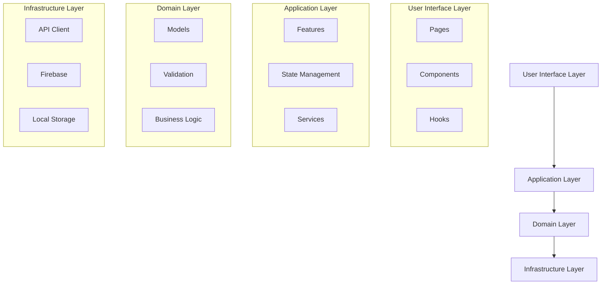

# Technical Documentation

## Refereezy Web Application Architecture

This document provides detailed technical documentation for developers working on the Refereezy Web Application. It covers the architecture, key technologies, code structure, and development practices.

## Technology Stack

### Frontend Technologies

The Refereezy web application is built with the following technologies:

- **Framework**: Next.js 13+ (React)
- **Language**: TypeScript
- **State Management**: Redux Toolkit
- **Styling**: Tailwind CSS
- **UI Component Library**: Material UI
- **API Client**: Axios
- **Real-time Communication**: Firebase Realtime Database and Socket.IO
- **Form Handling**: React Hook Form
- **Data Validation**: Zod
- **Testing**: Jest and React Testing Library
- **Build Tools**: Webpack (via Next.js)

### Backend Integration

The web application integrates with:

- **API**: Refereezy RESTful API (FastAPI)
- **Authentication**: JWT-based auth via the API
- **Database**: PostgreSQL (via API)
- **Real-time Database**: Firebase Realtime Database
- **File Storage**: AWS S3 / Cloudinary

## Application Structure

The application follows a modular architecture based on feature domains:

```
src/
├── components/              # Shared UI components
│   ├── common/              # Truly reusable UI components
│   ├── layout/              # Layout components
│   └── feature-specific/    # Components tied to specific features
├── contexts/                # React contexts for state sharing
├── features/                # Feature modules
│   ├── auth/                # Authentication feature
│   ├── matches/             # Match management feature
│   ├── teams/               # Team management feature
│   ├── reports/             # Report generation feature
│   └── admin/               # Admin panel feature
├── hooks/                   # Custom React hooks
├── lib/                     # Utility libraries and services
│   ├── api/                 # API client and endpoints
│   ├── firebase/            # Firebase configuration and services
│   └── helpers/             # Utility functions
├── pages/                   # Next.js pages
├── public/                  # Static assets
├── store/                   # Redux store setup
│   ├── slices/              # Redux slices for state management
│   └── middleware/          # Redux middleware
├── styles/                  # Global styles and Tailwind configuration
└── types/                   # TypeScript type definitions
```

## Core Architecture

The application follows a clean architecture pattern with clear separation of concerns:



### State Management

Redux is used for global state management with a structure organized by feature:

```typescript
// Example Redux slice
import { createSlice, PayloadAction } from '@reduxjs/toolkit';
import { Match } from '@/types/match';

interface MatchesState {
  matches: Match[];
  activeMatch: Match | null;
  loading: boolean;
  error: string | null;
}

const initialState: MatchesState = {
  matches: [],
  activeMatch: null,
  loading: false,
  error: null,
};

const matchesSlice = createSlice({
  name: 'matches',
  initialState,
  reducers: {
    fetchMatchesStart(state) {
      state.loading = true;
      state.error = null;
    },
    fetchMatchesSuccess(state, action: PayloadAction<Match[]>) {
      state.matches = action.payload;
      state.loading = false;
    },
    fetchMatchesFailure(state, action: PayloadAction<string>) {
      state.loading = false;
      state.error = action.payload;
    },
    setActiveMatch(state, action: PayloadAction<Match>) {
      state.activeMatch = action.payload;
    },
  },
});

export const { 
  fetchMatchesStart, 
  fetchMatchesSuccess, 
  fetchMatchesFailure,
  setActiveMatch 
} = matchesSlice.actions;
export default matchesSlice.reducer;
```

### API Integration

API calls are centralized in service modules:

```typescript
// Example API service for matches
import axios from '@/lib/api/axios';
import { Match, MatchCreate } from '@/types/match';

const MATCHES_URL = '/matches';

export const MatchService = {
  async getAll(): Promise<Match[]> {
    const response = await axios.get(MATCHES_URL);
    return response.data;
  },
  
  async getById(id: number): Promise<Match> {
    const response = await axios.get(`${MATCHES_URL}/${id}`);
    return response.data;
  },
  
  async getByClient(clientId: number): Promise<Match[]> {
    const response = await axios.get(`${MATCHES_URL}/client/${clientId}`);
    return response.data;
  },
  
  async create(match: MatchCreate): Promise<Match> {
    const response = await axios.post(MATCHES_URL, match);
    return response.data;
  },
  
  async update(id: number, match: MatchCreate): Promise<Match> {
    const response = await axios.put(`${MATCHES_URL}/${id}`, match);
    return response.data;
  },
  
  async delete(id: number): Promise<void> {
    await axios.delete(`${MATCHES_URL}/${id}`);
  },
};
```

### Firebase Real-time Integration

Firebase is used for real-time updates:

```typescript
// Firebase service for real-time match data
import { database } from '@/lib/firebase/config';
import { ref, onValue, off, update } from 'firebase/database';
import { Match } from '@/types/match';

export const MatchRealtimeService = {
  subscribeToMatch(matchId: string, callback: (data: any) => void) {
    const matchRef = ref(database, `matches/${matchId}`);
    onValue(matchRef, (snapshot) => {
      const data = snapshot.val();
      callback(data);
    });
    
    // Return unsubscribe function
    return () => off(matchRef);
  },
  
  updateMatchData(matchId: string, data: Partial<Match>) {
    const matchRef = ref(database, `matches/${matchId}`);
    return update(matchRef, data);
  },
  
  subscribeToIncidents(matchId: string, callback: (data: any) => void) {
    const incidentsRef = ref(database, `matches/${matchId}/incidents`);
    onValue(incidentsRef, (snapshot) => {
      const data = snapshot.val();
      callback(data ? Object.values(data) : []);
    });
    
    // Return unsubscribe function
    return () => off(incidentsRef);
  }
};
```

### Authentication Flow

The authentication flow is implemented using JWT:

```typescript
// Authentication service
import axios from '@/lib/api/axios';
import { User, LoginCredentials } from '@/types/auth';

export const AuthService = {
  async login(credentials: LoginCredentials): Promise<User> {
    const response = await axios.post('/clients/login', credentials);
    const { token, ...user } = response.data;
    
    // Store token in local storage
    localStorage.setItem('token', token);
    
    // Set default Authorization header for all future requests
    axios.defaults.headers.common['Authorization'] = `Bearer ${token}`;
    
    return user;
  },
  
  logout(): void {
    localStorage.removeItem('token');
    delete axios.defaults.headers.common['Authorization'];
  },
  
  getCurrentUser(): User | null {
    // Implement token validation and user retrieval
    const token = localStorage.getItem('token');
    if (!token) return null;
    
    // In a real application, you might want to decode the JWT
    // to get the user information or make an API call to validate
    
    // This is just a placeholder
    return null;
  },
  
  initializeAuth(): void {
    const token = localStorage.getItem('token');
    if (token) {
      axios.defaults.headers.common['Authorization'] = `Bearer ${token}`;
    }
  }
};
```

## Component Architecture

Components follow a hierarchical organization with specialized patterns:

### Page Components

Next.js pages that serve as entry points to features:

```typescript
// Example page component
import { useEffect } from 'react';
import { useDispatch, useSelector } from 'react-redux';
import { RootState } from '@/store';
import { fetchMatchesStart, fetchMatchesSuccess, fetchMatchesFailure } from '@/store/slices/matchesSlice';
import { MatchService } from '@/lib/api/services/matchService';
import { MatchList } from '@/components/matches/MatchList';
import { DashboardLayout } from '@/components/layout/DashboardLayout';

export default function MatchesPage() {
  const dispatch = useDispatch();
  const { matches, loading, error } = useSelector((state: RootState) => state.matches);
  
  useEffect(() => {
    const loadMatches = async () => {
      try {
        dispatch(fetchMatchesStart());
        const matchesData = await MatchService.getAll();
        dispatch(fetchMatchesSuccess(matchesData));
      } catch (err) {
        dispatch(fetchMatchesFailure(err.message));
      }
    };
    
    loadMatches();
  }, [dispatch]);
  
  return (
    <DashboardLayout>
      <h1 className="text-2xl font-bold mb-4">Matches</h1>
      {loading ? (
        <p>Loading matches...</p>
      ) : error ? (
        <p className="text-red-500">Error: {error}</p>
      ) : (
        <MatchList matches={matches} />
      )}
    </DashboardLayout>
  );
}
```

### Feature Components

Components that implement specific features:

```typescript
// Example feature component
import { useState } from 'react';
import { useDispatch } from 'react-redux';
import { setActiveMatch } from '@/store/slices/matchesSlice';
import { Match } from '@/types/match';
import { Card, Avatar, Badge, Button } from '@/components/common';

interface MatchListProps {
  matches: Match[];
}

export function MatchList({ matches }: MatchListProps) {
  const dispatch = useDispatch();
  
  const handleSelectMatch = (match: Match) => {
    dispatch(setActiveMatch(match));
  };
  
  return (
    <div className="grid grid-cols-1 md:grid-cols-2 lg:grid-cols-3 gap-4">
      {matches.map((match) => (
        <Card key={match.id} className="p-4">
          <div className="flex justify-between items-center mb-4">
            <div className="flex items-center">
              <Avatar src={match.local_team.logo_url} alt={match.local_team.name} size="md" />
              <span className="mx-2">vs</span>
              <Avatar src={match.visitor_team.logo_url} alt={match.visitor_team.name} size="md" />
            </div>
            <Badge 
              variant={match.date > new Date() ? 'primary' : 'secondary'}
              label={match.date > new Date() ? 'Upcoming' : 'Completed'}
            />
          </div>
          
          <h3 className="text-lg font-semibold mb-2">
            {match.local_team.name} vs {match.visitor_team.name}
          </h3>
          
          <p className="text-gray-600 mb-4">
            {new Date(match.date).toLocaleString()}
          </p>
          
          <Button 
            variant="primary" 
            fullWidth 
            onClick={() => handleSelectMatch(match)}
          >
            View Details
          </Button>
        </Card>
      ))}
    </div>
  );
}
```

### Common Components

Reusable UI building blocks:

```typescript
// Example common component
import { ReactNode, ButtonHTMLAttributes } from 'react';
import cx from 'classnames';

type ButtonVariant = 'primary' | 'secondary' | 'danger' | 'ghost';

interface ButtonProps extends ButtonHTMLAttributes<HTMLButtonElement> {
  variant?: ButtonVariant;
  size?: 'sm' | 'md' | 'lg';
  fullWidth?: boolean;
  loading?: boolean;
  icon?: ReactNode;
  children: ReactNode;
}

export function Button({
  variant = 'primary',
  size = 'md',
  fullWidth = false,
  loading = false,
  icon,
  children,
  className,
  disabled,
  ...props
}: ButtonProps) {
  const baseClasses = 'inline-flex items-center justify-center rounded font-medium focus:outline-none focus:ring-2 focus:ring-offset-2';
  
  const variantClasses = {
    primary: 'bg-blue-600 text-white hover:bg-blue-700 focus:ring-blue-500',
    secondary: 'bg-gray-200 text-gray-800 hover:bg-gray-300 focus:ring-gray-500',
    danger: 'bg-red-600 text-white hover:bg-red-700 focus:ring-red-500',
    ghost: 'bg-transparent text-gray-600 hover:bg-gray-100 focus:ring-gray-500',
  };
  
  const sizeClasses = {
    sm: 'text-sm py-1 px-3',
    md: 'text-base py-2 px-4',
    lg: 'text-lg py-3 px-6',
  };
  
  const classes = cx(
    baseClasses,
    variantClasses[variant],
    sizeClasses[size],
    {
      'w-full': fullWidth,
      'opacity-75 cursor-not-allowed': disabled || loading,
    },
    className
  );
  
  return (
    <button
      className={classes}
      disabled={disabled || loading}
      {...props}
    >
      {loading && (
        <svg className="animate-spin -ml-1 mr-2 h-4 w-4" xmlns="http://www.w3.org/2000/svg" fill="none" viewBox="0 0 24 24">
          <circle className="opacity-25" cx="12" cy="12" r="10" stroke="currentColor" strokeWidth="4"></circle>
          <path className="opacity-75" fill="currentColor" d="M4 12a8 8 0 018-8V0C5.373 0 0 5.373 0 12h4zm2 5.291A7.962 7.962 0 014 12H0c0 3.042 1.135 5.824 3 7.938l3-2.647z"></path>
        </svg>
      )}
      {icon && !loading && <span className="mr-2">{icon}</span>}
      {children}
    </button>
  );
}
```

## Real-time Features Implementation

Real-time features use a combination of Firebase and Socket.IO:

### Socket.IO Integration

For low-latency updates:

```typescript
// Socket.IO service
import { io, Socket } from 'socket.io-client';
import { getConfig } from '@/lib/config';

let socket: Socket | null = null;

export const socketService = {
  connect() {
    const { SOCKET_URL } = getConfig();
    
    if (!socket) {
      socket = io(SOCKET_URL, {
        transports: ['websocket'],
        autoConnect: true,
      });
      
      socket.on('connect', () => {
        console.log('Socket connected');
      });
      
      socket.on('disconnect', () => {
        console.log('Socket disconnected');
      });
      
      socket.on('error', (error) => {
        console.error('Socket error:', error);
      });
    }
    
    return socket;
  },
  
  disconnect() {
    if (socket) {
      socket.disconnect();
      socket = null;
    }
  },
  
  on(event: string, callback: (...args: any[]) => void) {
    if (!socket) this.connect();
    socket?.on(event, callback);
    
    return () => {
      socket?.off(event, callback);
    };
  },
  
  emit(event: string, data: any) {
    if (!socket) this.connect();
    socket?.emit(event, data);
  },
};
```

### Live Match Viewer Component

Example of a component using real-time data:

```typescript
// LiveMatchViewer component
import { useEffect, useState } from 'react';
import { MatchRealtimeService } from '@/lib/firebase/matchRealtimeService';
import { socketService } from '@/lib/socket/socketService';
import { Match, Incident } from '@/types/match';
import { Scoreboard, Timeline, TeamStats } from '@/components/matches';

interface LiveMatchViewerProps {
  matchId: string;
}

export function LiveMatchViewer({ matchId }: LiveMatchViewerProps) {
  const [matchData, setMatchData] = useState<Match | null>(null);
  const [incidents, setIncidents] = useState<Incident[]>([]);
  const [viewers, setViewers] = useState<number>(0);
  
  useEffect(() => {
    // Subscribe to Firebase for match data
    const unsubscribeMatch = MatchRealtimeService.subscribeToMatch(
      matchId,
      (data) => {
        if (data) setMatchData(data);
      }
    );
    
    // Subscribe to Firebase for incidents
    const unsubscribeIncidents = MatchRealtimeService.subscribeToIncidents(
      matchId,
      (data) => {
        if (data) setIncidents(data);
      }
    );
    
    // Connect to Socket.IO for viewer count
    const socket = socketService.connect();
    
    // Join match room
    socket.emit('join_match', { matchId });
    
    // Listen for viewer count updates
    const unsubscribeViewers = socketService.on(
      'viewer_count',
      (count: number) => {
        setViewers(count);
      }
    );
    
    return () => {
      unsubscribeMatch();
      unsubscribeIncidents();
      unsubscribeViewers();
      socket.emit('leave_match', { matchId });
    };
  }, [matchId]);
  
  if (!matchData) {
    return <div>Loading match data...</div>;
  }
  
  return (
    <div className="grid grid-cols-1 lg:grid-cols-3 gap-6">
      <div className="lg:col-span-2">
        <Scoreboard 
          match={matchData} 
          viewerCount={viewers}
        />
        
        <Timeline incidents={incidents} />
      </div>
      
      <div>
        <TeamStats match={matchData} />
      </div>
    </div>
  );
}
```

## Form Handling and Validation

Forms are handled with React Hook Form and validated with Zod:

```typescript
// Example form component with validation
import { useForm } from 'react-hook-form';
import { zodResolver } from '@hookform/resolvers/zod';
import { z } from 'zod';
import { Button, TextField, DateTimePicker, Select } from '@/components/common';
import { TeamService } from '@/lib/api/services/teamService';
import { RefereeService } from '@/lib/api/services/refereeService';
import { MatchService } from '@/lib/api/services/matchService';
import { useEffect, useState } from 'react';
import { Team } from '@/types/team';
import { Referee } from '@/types/referee';

const createMatchSchema = z.object({
  local_team_id: z.number().positive('Local team is required'),
  visitor_team_id: z.number().positive('Visitor team is required'),
  date: z.date().min(new Date(), 'Match date must be in the future'),
  referee_id: z.number().positive('Referee is required'),
  client_id: z.number().positive('Client is required'),
});

type CreateMatchFormData = z.infer<typeof createMatchSchema>;

interface CreateMatchFormProps {
  clientId: number;
  onSuccess: (matchId: number) => void;
}

export function CreateMatchForm({ clientId, onSuccess }: CreateMatchFormProps) {
  const [teams, setTeams] = useState<Team[]>([]);
  const [referees, setReferees] = useState<Referee[]>([]);
  const [loading, setLoading] = useState(false);
  
  const { 
    register, 
    handleSubmit, 
    formState: { errors }, 
    control 
  } = useForm<CreateMatchFormData>({
    resolver: zodResolver(createMatchSchema),
    defaultValues: {
      client_id: clientId,
    },
  });
  
  useEffect(() => {
    const loadData = async () => {
      try {
        const [teamsData, refereesData] = await Promise.all([
          TeamService.getByClient(clientId),
          RefereeService.getByClient(clientId),
        ]);
        
        setTeams(teamsData);
        setReferees(refereesData);
      } catch (error) {
        console.error('Failed to load form data:', error);
      }
    };
    
    loadData();
  }, [clientId]);
  
  const onSubmit = async (data: CreateMatchFormData) => {
    try {
      setLoading(true);
      const newMatch = await MatchService.create(data);
      onSuccess(newMatch.id);
    } catch (error) {
      console.error('Failed to create match:', error);
    } finally {
      setLoading(false);
    }
  };
  
  return (
    <form onSubmit={handleSubmit(onSubmit)} className="space-y-6">
      <h2 className="text-xl font-semibold">Create New Match</h2>
      
      <Select
        label="Local Team"
        error={errors.local_team_id?.message}
        {...register('local_team_id', { valueAsNumber: true })}
      >
        <option value="">Select Local Team</option>
        {teams.map((team) => (
          <option key={team.id} value={team.id}>
            {team.name}
          </option>
        ))}
      </Select>
      
      <Select
        label="Visitor Team"
        error={errors.visitor_team_id?.message}
        {...register('visitor_team_id', { valueAsNumber: true })}
      >
        <option value="">Select Visitor Team</option>
        {teams.map((team) => (
          <option key={team.id} value={team.id}>
            {team.name}
          </option>
        ))}
      </Select>
      
      <DateTimePicker
        label="Match Date and Time"
        control={control}
        name="date"
        error={errors.date?.message}
      />
      
      <Select
        label="Referee"
        error={errors.referee_id?.message}
        {...register('referee_id', { valueAsNumber: true })}
      >
        <option value="">Select Referee</option>
        {referees.map((referee) => (
          <option key={referee.id} value={referee.id}>
            {referee.name}
          </option>
        ))}
      </Select>
      
      <Button
        type="submit"
        variant="primary"
        fullWidth
        loading={loading}
      >
        Create Match
      </Button>
    </form>
  );
}
```

## Internationalization

The application supports multiple languages using next-i18next:

```typescript
// i18n setup
// i18n.ts
import { createI18nClient } from 'next-i18n-router/client';
import i18nConfig from '../i18n.config';

export const { I18nProvider, useI18n, useScopedI18n, getI18n } = createI18nClient(i18nConfig);
```

```typescript
// Example of a component with translations
import { useTranslation } from 'next-i18next';
import { Button } from '@/components/common';

export function LanguageSwitcher() {
  const { t, i18n } = useTranslation('common');
  
  const changeLanguage = (lng: string) => {
    i18n.changeLanguage(lng);
  };
  
  return (
    <div className="flex space-x-2">
      <Button 
        variant="ghost" 
        size="sm" 
        onClick={() => changeLanguage('en')}
        className={i18n.language === 'en' ? 'font-bold' : ''}
      >
        {t('language.english')}
      </Button>
      <Button 
        variant="ghost" 
        size="sm" 
        onClick={() => changeLanguage('ca')}
        className={i18n.language === 'ca' ? 'font-bold' : ''}
      >
        {t('language.catalan')}
      </Button>
      <Button 
        variant="ghost" 
        size="sm" 
        onClick={() => changeLanguage('es')}
        className={i18n.language === 'es' ? 'font-bold' : ''}
      >
        {t('language.spanish')}
      </Button>
    </div>
  );
}
```

## Error Handling

The application uses a centralized error handling approach:

```typescript
// Error handling utilities
import { toast } from 'react-toastify';

export enum ErrorType {
  NETWORK = 'network',
  AUTH = 'auth',
  VALIDATION = 'validation',
  SERVER = 'server',
  UNKNOWN = 'unknown',
}

export interface AppError {
  type: ErrorType;
  message: string;
  originalError?: any;
}

export const errorHandler = {
  handleError(error: any): AppError {
    console.error('Error occurred:', error);
    
    let appError: AppError = {
      type: ErrorType.UNKNOWN,
      message: 'An unexpected error occurred',
      originalError: error,
    };
    
    if (error.isAxiosError) {
      if (!error.response) {
        appError = {
          type: ErrorType.NETWORK,
          message: 'Network error: Could not connect to server',
          originalError: error,
        };
      } else {
        const status = error.response.status;
        
        if (status === 401 || status === 403) {
          appError = {
            type: ErrorType.AUTH,
            message: 'Authentication error: Please log in again',
            originalError: error,
          };
        } else if (status === 400 || status === 422) {
          appError = {
            type: ErrorType.VALIDATION,
            message: error.response.data.detail || 'Validation error: Please check your input',
            originalError: error,
          };
        } else {
          appError = {
            type: ErrorType.SERVER,
            message: error.response.data.detail || 'Server error: Please try again later',
            originalError: error,
          };
        }
      }
    }
    
    // Display error to user
    toast.error(appError.message);
    
    return appError;
  },
};
```

## Testing Strategy

The application is tested at multiple levels:

### Unit Tests

For testing individual functions and components:

```typescript
// Example unit test for a utility function
import { formatMatchTime } from '@/lib/helpers/timeFormatters';

describe('timeFormatters', () => {
  describe('formatMatchTime', () => {
    it('formats seconds correctly', () => {
      expect(formatMatchTime(65)).toBe('01:05');
      expect(formatMatchTime(3600)).toBe('60:00');
      expect(formatMatchTime(0)).toBe('00:00');
    });
    
    it('handles negative values', () => {
      expect(formatMatchTime(-10)).toBe('00:00');
    });
  });
});
```

### Component Tests

For testing UI components:

```typescript
// Example component test
import { render, screen, fireEvent } from '@testing-library/react';
import { Scoreboard } from '@/components/matches/Scoreboard';

const mockMatch = {
  id: 1,
  local_team: {
    id: 1,
    name: 'Team A',
    logo_url: '/team-a-logo.png',
    primary_color: '#ff0000',
  },
  visitor_team: {
    id: 2,
    name: 'Team B',
    logo_url: '/team-b-logo.png',
    primary_color: '#0000ff',
  },
  score: {
    home: 2,
    away: 1,
  },
  current_time: '35:12',
  period: 1,
};

describe('Scoreboard', () => {
  it('renders team names correctly', () => {
    render(<Scoreboard match={mockMatch} viewerCount={42} />);
    
    expect(screen.getByText('Team A')).toBeInTheDocument();
    expect(screen.getByText('Team B')).toBeInTheDocument();
  });
  
  it('displays the current score', () => {
    render(<Scoreboard match={mockMatch} viewerCount={42} />);
    
    expect(screen.getByText('2')).toBeInTheDocument();
    expect(screen.getByText('1')).toBeInTheDocument();
  });
  
  it('shows match time and period', () => {
    render(<Scoreboard match={mockMatch} viewerCount={42} />);
    
    expect(screen.getByText('35:12')).toBeInTheDocument();
    expect(screen.getByText('Period: 1')).toBeInTheDocument();
  });
  
  it('displays viewer count', () => {
    render(<Scoreboard match={mockMatch} viewerCount={42} />);
    
    expect(screen.getByText('42 viewers')).toBeInTheDocument();
  });
});
```

### Integration Tests

For testing interactions between components:

```typescript
// Example integration test
import { render, screen, fireEvent, waitFor } from '@testing-library/react';
import { Provider } from 'react-redux';
import { configureStore } from '@reduxjs/toolkit';
import matchesReducer from '@/store/slices/matchesSlice';
import { MatchList } from '@/components/matches/MatchList';
import { MatchDetail } from '@/components/matches/MatchDetail';
import { MatchPage } from '@/pages/matches';

// Mock the store
const createTestStore = (initialState = {}) => {
  return configureStore({
    reducer: {
      matches: matchesReducer,
    },
    preloadedState: initialState,
  });
};

// Mock API service
jest.mock('@/lib/api/services/matchService', () => ({
  MatchService: {
    getAll: jest.fn().mockResolvedValue([
      {
        id: 1,
        local_team: { id: 1, name: 'Team A' },
        visitor_team: { id: 2, name: 'Team B' },
        date: new Date().toISOString(),
      },
    ]),
  },
}));

describe('Match Page Integration', () => {
  it('loads and displays matches', async () => {
    const store = createTestStore();
    
    render(
      <Provider store={store}>
        <MatchPage />
      </Provider>
    );
    
    // Check loading state
    expect(screen.getByText('Loading matches...')).toBeInTheDocument();
    
    // Wait for matches to load
    await waitFor(() => {
      expect(screen.getByText('Team A vs Team B')).toBeInTheDocument();
    });
    
    // Click on a match
    fireEvent.click(screen.getByText('View Details'));
    
    // Check if match detail component renders with selected match
    await waitFor(() => {
      expect(store.getState().matches.activeMatch).not.toBeNull();
    });
  });
});
```

## Performance Optimization Techniques

The application employs several performance optimization techniques:

### Code Splitting

Next.js dynamic imports for code splitting:

```typescript
// Dynamic import example
import dynamic from 'next/dynamic';

const DynamicMatchReport = dynamic(
  () => import('@/components/reports/MatchReport'),
  {
    loading: () => <p>Loading report...</p>,
    ssr: false, // Disable server-side rendering
  }
);

export default function ReportPage({ matchId }) {
  return (
    <div>
      <h1>Match Report</h1>
      <DynamicMatchReport matchId={matchId} />
    </div>
  );
}
```

### Memoization

Component memoization to prevent unnecessary re-renders:

```typescript
// Memoized component example
import { memo, useMemo } from 'react';
import { Team } from '@/types/team';

interface TeamStatsProps {
  team: Team;
  stats: {
    possession: number;
    shots: number;
    shotsOnTarget: number;
    corners: number;
    fouls: number;
  };
}

export const TeamStats = memo(function TeamStats({ team, stats }: TeamStatsProps) {
  // Expensive calculation
  const efficiency = useMemo(() => {
    if (stats.shots === 0) return 0;
    return Math.round((stats.shotsOnTarget / stats.shots) * 100);
  }, [stats.shots, stats.shotsOnTarget]);
  
  return (
    <div className="p-4 border rounded">
      <h3 className="font-semibold text-lg">{team.name} Statistics</h3>
      <ul className="mt-2 space-y-1">
        <li>Possession: {stats.possession}%</li>
        <li>Shots: {stats.shots}</li>
        <li>Shots on Target: {stats.shotsOnTarget}</li>
        <li>Shot Efficiency: {efficiency}%</li>
        <li>Corners: {stats.corners}</li>
        <li>Fouls: {stats.fouls}</li>
      </ul>
    </div>
  );
});
```

### Image Optimization

Next.js Image component for optimized images:

```typescript
// Optimized image example
import Image from 'next/image';
import { Team } from '@/types/team';

interface TeamLogoProps {
  team: Team;
  size?: 'sm' | 'md' | 'lg';
}

const sizes = {
  sm: { width: 32, height: 32 },
  md: { width: 64, height: 64 },
  lg: { width: 128, height: 128 },
};

export function TeamLogo({ team, size = 'md' }: TeamLogoProps) {
  const { width, height } = sizes[size];
  
  return (
    <div 
      style={{ backgroundColor: team.primary_color }}
      className="flex items-center justify-center rounded-full overflow-hidden"
    >
      <Image
        src={team.logo_url}
        alt={`${team.name} logo`}
        width={width}
        height={height}
        className="object-contain"
        loading="lazy"
      />
    </div>
  );
}
```

## Security Measures

The application implements several security measures:

### Content Security Policy

Next.js configured with a Content Security Policy:

```typescript
// next.config.js
const securityHeaders = [
  {
    key: 'Content-Security-Policy',
    value: `
      default-src 'self';
      script-src 'self' 'unsafe-eval' https://apis.google.com;
      style-src 'self' 'unsafe-inline';
      img-src 'self' data: https://res.cloudinary.com;
      font-src 'self';
      connect-src 'self' https://api.refereezy.com https://*.firebaseio.com;
      frame-src 'self';
      object-src 'none';
    `.replace(/\s{2,}/g, ' ').trim()
  },
  {
    key: 'X-XSS-Protection',
    value: '1; mode=block'
  },
  {
    key: 'X-Frame-Options',
    value: 'SAMEORIGIN'
  },
  {
    key: 'X-Content-Type-Options',
    value: 'nosniff'
  },
  {
    key: 'Referrer-Policy',
    value: 'origin-when-cross-origin'
  }
];

module.exports = {
  async headers() {
    return [
      {
        source: '/:path*',
        headers: securityHeaders,
      },
    ];
  },
  // Other Next.js configuration
};
```

### API Request Validation

Zod validation for API requests:

```typescript
// API request validation
import { z } from 'zod';

// Define the schema for API request validation
const createIncidentSchema = z.object({
  type: z.enum(['goal', 'yellow_card', 'red_card', 'foul', 'substitution']),
  gameTime: z.string().regex(/^\d{2}:\d{2}$/),
  period: z.number().int().positive(),
  teamId: z.number().int().positive(),
  playerId: z.number().int().positive().optional(),
  details: z.string().max(500).optional(),
});

// Validate an API request
export function validateIncidentRequest(data: unknown) {
  try {
    const validated = createIncidentSchema.parse(data);
    return { valid: true, data: validated };
  } catch (error) {
    return { 
      valid: false, 
      errors: error.errors 
    };
  }
}
```

## Deployment Configuration

The application is configured for deployment in different environments:

```typescript
// config.ts
interface Config {
  API_URL: string;
  FIREBASE_CONFIG: {
    apiKey: string;
    authDomain: string;
    databaseURL: string;
    projectId: string;
    storageBucket: string;
    messagingSenderId: string;
    appId: string;
  };
  SOCKET_URL: string;
}

const development: Config = {
  API_URL: 'http://localhost:8080',
  FIREBASE_CONFIG: {
    apiKey: 'dev-api-key',
    // Other Firebase config
  },
  SOCKET_URL: 'http://localhost:3001',
};

const staging: Config = {
  API_URL: 'https://api-staging.refereezy.com',
  FIREBASE_CONFIG: {
    apiKey: 'staging-api-key',
    // Other Firebase config
  },
  SOCKET_URL: 'https://socket-staging.refereezy.com',
};

const production: Config = {
  API_URL: 'https://api.refereezy.com',
  FIREBASE_CONFIG: {
    apiKey: 'prod-api-key',
    // Other Firebase config
  },
  SOCKET_URL: 'https://socket.refereezy.com',
};

const configs = {
  development,
  staging,
  production,
};

export function getConfig(): Config {
  const env = process.env.NEXT_PUBLIC_ENV || 'development';
  return configs[env as keyof typeof configs];
}
```

## Conclusion

This technical documentation provides a comprehensive overview of the Refereezy Web Application architecture and implementation details. Developers should follow the patterns and practices outlined in this document when contributing to the project to maintain consistency and quality.

For more information on specific components or features, refer to the inline code documentation and comments within the source code.
