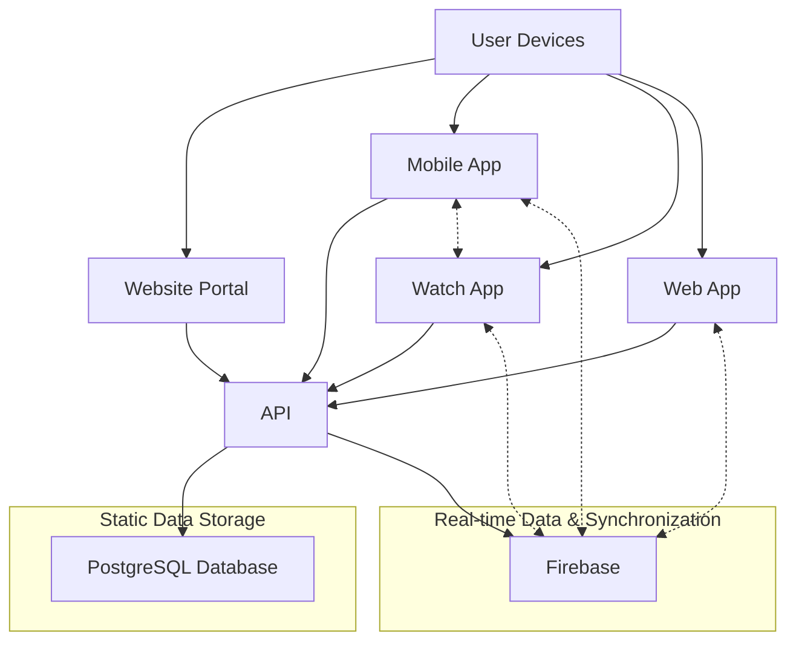

# Architecture

## System Architecture Overview

The Refereezy platform follows a modern, microservices-based architecture designed for scalability, reliability, and maintainability. This document describes the high-level architecture and the interactions between different components.

## Architecture Diagram

## Core Components

### Client Applications

1. **Website Portal** - Public-facing website for match organization and management
   - Technologies: HTML, CSS, JavaScript
   - Main functionality: User registration, match scheduling, team management

2. **Mobile App** - Smartphone application for referees
   - Technologies: React Native
   - Main functionality: Match management, incident recording, report generation

3. **Watch App** - Smartwatch companion app
   - Technologies: Android Wear OS
   - Main functionality: Quick incident recording, match timing

4. **Web App** - Real-time match display and reporting
   - Technologies: HTML, CSS, JavaScript, Socket.IO
   - Main functionality: Live match updates, report viewing, data visualization

### Server Components

1. **API** - Central API for data management
   - Technologies: FastAPI (Python)
   - Main functionality: CRUD operations, business logic, authentication

2. **Socket Server** - Real-time communication server
   - Technologies: Node.js, Socket.IO
   - Main functionality: Real-time updates, match state synchronization

### Data Storage

1. **PostgreSQL Database** - Persistent data storage
   - Contains: User accounts, matches, teams, players, static configurations

2. **Firebase** - Real-time data and document storage
   - Contains: Match reports, incidents, real-time match state
   - Provides: Real-time synchronization across devices

## Data Flow

1. **Match Creation**
   - User creates match via Website Portal
   - Data is stored in PostgreSQL via the API
   - Match is assigned to referee

2. **Match Reporting**
   - Referee uses Mobile/Watch App to record incidents
   - Data is sent to API and stored in Firebase
   - Real-time updates are pushed to all connected clients via Firebase and Socket.IO

3. **Viewing & Analysis**
   - Web App displays real-time match data
   - Historical match data is available through the API
   - Reports can be generated and exported

## Security Model

1. **Authentication**
   - JWT-based authentication for API access
   - Firebase Authentication for real-time features
   - Role-based access control (Admin, Referee, User)

2. **Data Protection**
   - Encrypted data transmission (HTTPS/SSL)
   - Secure storage practices
   - Input validation and sanitization

## Scaling Considerations

- Horizontal scaling for API servers
- Cloud-based deployment for automatic scaling
- Caching strategies for frequently accessed data
- Database replication and sharding for high-volume scenarios

---

*Note: This is a starting point for documenting the architecture. Add detailed sequence diagrams for key user flows, component diagrams for each major subsystem, and data models with entity relationships.*
