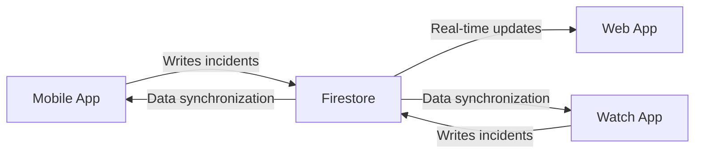

# Firebase Integration

## Firebase in Refereezy

Firebase is a critical component of the Refereezy platform, providing real-time data synchronization, authentication, and document storage. This document explains how Firebase is integrated into the application architecture.

## Services Used

### Firestore Database

Firestore is used for storing and synchronizing real-time data, including:

- Match reports
- Match incidents
- Clock synchronization status
- Real-time match state



### Authentication

Firebase Authentication is used for:

- Secure user authentication
- Integration with social logins (if applicable)
- Management of user sessions

### Storage

Firebase Storage is used for:

- Storing media files (photos, videos)
- Backup of report documents
- Storing game assets

## Configuration

### Web App Configuration

The web application connects to Firebase using environment variables:

```typescript
const firebaseConfig = {
  apiKey: process.env.FIREBASE_KEY,
  authDomain: process.env.FIREBASE_AUTH_DOMAIN,
  projectId: process.env.FIREBASE_PROJECT_ID,
  storageBucket: process.env.FIREBASE_STORAGE_BUCKET,
  messagingSenderId: process.env.FIREBASE_MESSAGING_SENDER_ID,
  appId: process.env.FIREBASE_APP_ID,
  measurementId: process.env.FIREBASE_MEASUREMENT_ID
};

const app = initializeApp(firebaseConfig);
const db = getFirestore(app);
```

### Mobile App Configuration

The mobile app requires:

1. A `google-services.json` file in the Android app directory
2. Firebase configuration in the app code

### API Integration

The API interacts with Firebase using admin SDK:

```python
import firebase_admin
from firebase_admin import credentials, firestore

cred = credentials.Certificate('path/to/serviceAccountKey.json')
firebase_admin.initialize_app(cred)
db = firestore.client()
```

## Data Models

### Reports Collection

The main collection for match reports:

```typescript
interface Report {
  id: string;
  matchId: string;
  refereeId: string;
  timestamp: Timestamp;
  status: 'draft' | 'in-progress' | 'completed';
  score: {
    home: number;
    away: number;
  };
  teams: {
    home: {
      id: string;
      name: string;
      players: Player[];
    };
    away: {
      id: string;
      name: string;
      players: Player[];
    };
  };
  incidents: Incident[];
  clockData: ClockData;
}
```

### Incidents Sub-collection

Records of events during a match:

```typescript
interface Incident {
  id: string;
  type: 'goal' | 'card' | 'substitution' | 'timeout' | 'foul' | 'other';
  timestamp: Timestamp;
  gameTime: string; // "MM:SS" format
  period: number;
  team: 'home' | 'away';
  playerId?: string;
  details: string;
}
```

## Real-time Listeners

Example of setting up real-time listeners:

```typescript
// Listen for changes in a specific report
const unsubscribe = onSnapshot(
  doc(db, "reports", reportId), 
  (doc) => {
    console.log("Current data: ", doc.data());
    // Update UI with new data
  }
);

// Clean up listener when no longer needed
unsubscribe();
```

## Security Rules

Sample Firestore security rules:

```
service cloud.firestore {
  match /databases/{database}/documents {
    match /reports/{reportId} {
      allow read: if true;  // Public read for reports
      allow write: if request.auth != null 
                   && request.auth.token.role == 'referee';
    }
  }
}
```

## Best Practices

1. **Offline Support**
   - Configure Firebase to work offline and sync when connection is restored
   - This is particularly important for the mobile and watch apps

2. **Data Denormalization**
   - Optimize for read performance by denormalizing data
   - Store frequently accessed data together

3. **Batch Operations**
   - Use batch writes for related changes
   - Improves reliability and atomic operations

4. **Security**
   - Keep API keys secure using environment variables
   - Implement strict security rules
   - Regularly review and update permissions

5. **Cost Management**
   - Monitor read/write operations
   - Implement caching strategies
   - Consider data archiving for older reports

---

*Note: Add detailed code examples for each platform (web, mobile, watch), include troubleshooting sections, and expand the data model documentation with all collections and their relationships.*
