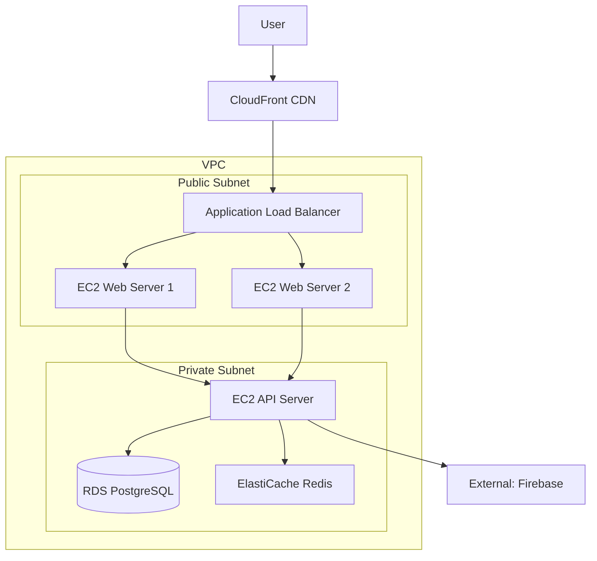

# AWS Setup

## AWS Infrastructure Configuration

This document outlines the setup and configuration of the AWS cloud infrastructure used for hosting the Refereezy platform.

## Architecture Overview

The Refereezy platform is hosted on AWS using a multi-tier architecture designed for scalability, reliability, and security.



## AWS Account Setup

### IAM Configuration

1. **Create Admin IAM Group**
   ```bash
   aws iam create-group --group-name Refereezy-Admins
   aws iam attach-group-policy --group-name Refereezy-Admins --policy-arn arn:aws:iam::aws:policy/AdministratorAccess
   ```

2. **Create Developer IAM Group**
   ```bash
   aws iam create-group --group-name Refereezy-Developers
   aws iam attach-group-policy --group-name Refereezy-Developers --policy-arn arn:aws:iam::aws:policy/PowerUserAccess
   ```

3. **Create IAM Users**
   ```bash
   aws iam create-user --user-name admin1
   aws iam add-user-to-group --user-name admin1 --group-name Refereezy-Admins
   
   aws iam create-user --user-name developer1
   aws iam add-user-to-group --user-name developer1 --group-name Refereezy-Developers
   ```

4. **Create Access Keys**
   ```bash
   aws iam create-access-key --user-name admin1
   aws iam create-access-key --user-name developer1
   ```

## Networking Setup

### VPC Configuration

1. **Create VPC**
   ```bash
   aws ec2 create-vpc --cidr-block 10.0.0.0/16 --tag-specifications 'ResourceType=vpc,Tags=[{Key=Name,Value=Refereezy-VPC}]'
   ```

2. **Create Subnets**
   ```bash
   # Public subnets
   aws ec2 create-subnet --vpc-id vpc-xxxxxxxx --cidr-block 10.0.1.0/24 --availability-zone eu-west-1a --tag-specifications 'ResourceType=subnet,Tags=[{Key=Name,Value=Public-1a}]'
   aws ec2 create-subnet --vpc-id vpc-xxxxxxxx --cidr-block 10.0.2.0/24 --availability-zone eu-west-1b --tag-specifications 'ResourceType=subnet,Tags=[{Key=Name,Value=Public-1b}]'
   
   # Private subnets
   aws ec2 create-subnet --vpc-id vpc-xxxxxxxx --cidr-block 10.0.3.0/24 --availability-zone eu-west-1a --tag-specifications 'ResourceType=subnet,Tags=[{Key=Name,Value=Private-1a}]'
   aws ec2 create-subnet --vpc-id vpc-xxxxxxxx --cidr-block 10.0.4.0/24 --availability-zone eu-west-1b --tag-specifications 'ResourceType=subnet,Tags=[{Key=Name,Value=Private-1b}]'
   ```

3. **Create Internet Gateway**
   ```bash
   aws ec2 create-internet-gateway --tag-specifications 'ResourceType=internet-gateway,Tags=[{Key=Name,Value=Refereezy-IGW}]'
   aws ec2 attach-internet-gateway --internet-gateway-id igw-xxxxxxxx --vpc-id vpc-xxxxxxxx
   ```

4. **Create NAT Gateway**
   ```bash
   # Allocate Elastic IP
   aws ec2 allocate-address --domain vpc
   
   # Create NAT Gateway
   aws ec2 create-nat-gateway --subnet-id subnet-xxxxxxxx --allocation-id eipalloc-xxxxxxxx
   ```

5. **Configure Route Tables**
   ```bash
   # Public Route Table
   aws ec2 create-route-table --vpc-id vpc-xxxxxxxx --tag-specifications 'ResourceType=route-table,Tags=[{Key=Name,Value=Public-RT}]'
   aws ec2 create-route --route-table-id rtb-xxxxxxxx --destination-cidr-block 0.0.0.0/0 --gateway-id igw-xxxxxxxx
   
   # Private Route Table
   aws ec2 create-route-table --vpc-id vpc-xxxxxxxx --tag-specifications 'ResourceType=route-table,Tags=[{Key=Name,Value=Private-RT}]'
   aws ec2 create-route --route-table-id rtb-yyyyyyyy --destination-cidr-block 0.0.0.0/0 --nat-gateway-id nat-xxxxxxxx
   
   # Associate route tables with subnets
   aws ec2 associate-route-table --route-table-id rtb-xxxxxxxx --subnet-id subnet-public1
   aws ec2 associate-route-table --route-table-id rtb-xxxxxxxx --subnet-id subnet-public2
   aws ec2 associate-route-table --route-table-id rtb-yyyyyyyy --subnet-id subnet-private1
   aws ec2 associate-route-table --route-table-id rtb-yyyyyyyy --subnet-id subnet-private2
   ```

## Security Groups

1. **Load Balancer Security Group**
   ```bash
   aws ec2 create-security-group --group-name Refereezy-LB-SG --description "Security group for load balancer" --vpc-id vpc-xxxxxxxx
   
   # Allow HTTP and HTTPS from anywhere
   aws ec2 authorize-security-group-ingress --group-id sg-xxxxxxxx --protocol tcp --port 80 --cidr 0.0.0.0/0
   aws ec2 authorize-security-group-ingress --group-id sg-xxxxxxxx --protocol tcp --port 443 --cidr 0.0.0.0/0
   ```

2. **Web Server Security Group**
   ```bash
   aws ec2 create-security-group --group-name Refereezy-Web-SG --description "Security group for web servers" --vpc-id vpc-xxxxxxxx
   
   # Allow HTTP and HTTPS from load balancer only
   aws ec2 authorize-security-group-ingress --group-id sg-yyyyyyyy --protocol tcp --port 80 --source-group sg-xxxxxxxx
   aws ec2 authorize-security-group-ingress --group-id sg-yyyyyyyy --protocol tcp --port 443 --source-group sg-xxxxxxxx
   
   # Allow SSH from bastion host
   aws ec2 authorize-security-group-ingress --group-id sg-yyyyyyyy --protocol tcp --port 22 --source-group sg-bastion
   ```

3. **API Server Security Group**
   ```bash
   aws ec2 create-security-group --group-name Refereezy-API-SG --description "Security group for API servers" --vpc-id vpc-xxxxxxxx
   
   # Allow API traffic from web servers only
   aws ec2 authorize-security-group-ingress --group-id sg-zzzzzzzz --protocol tcp --port 8080 --source-group sg-yyyyyyyy
   
   # Allow SSH from bastion host
   aws ec2 authorize-security-group-ingress --group-id sg-zzzzzzzz --protocol tcp --port 22 --source-group sg-bastion
   ```

4. **Database Security Group**
   ```bash
   aws ec2 create-security-group --group-name Refereezy-DB-SG --description "Security group for database" --vpc-id vpc-xxxxxxxx
   
   # Allow PostgreSQL from API servers only
   aws ec2 authorize-security-group-ingress --group-id sg-dbdbdbdb --protocol tcp --port 5432 --source-group sg-zzzzzzzz
   ```

## Compute Resources

### EC2 Instances

1. **Launch Web Servers**
   ```bash
   aws ec2 run-instances \
     --image-id ami-xxxxxxxx \
     --instance-type t3.medium \
     --key-name refereezy-key \
     --security-group-ids sg-yyyyyyyy \
     --subnet-id subnet-public1 \
     --tag-specifications 'ResourceType=instance,Tags=[{Key=Name,Value=Web-Server-1}]' \
     --user-data file://web-server-userdata.sh
   ```

2. **Launch API Server**
   ```bash
   aws ec2 run-instances \
     --image-id ami-xxxxxxxx \
     --instance-type t3.large \
     --key-name refereezy-key \
     --security-group-ids sg-zzzzzzzz \
     --subnet-id subnet-private1 \
     --tag-specifications 'ResourceType=instance,Tags=[{Key=Name,Value=API-Server}]' \
     --user-data file://api-server-userdata.sh
   ```

3. **Example Web Server User Data Script**
   ```bash
   #!/bin/bash
   apt update
   apt install -y nginx docker.io docker-compose
   systemctl enable docker
   systemctl start docker
   
   # Configure nginx as reverse proxy
   cat > /etc/nginx/sites-available/default << 'EOF'
   server {
       listen 80;
       server_name _;
       
       location / {
           proxy_pass http://localhost:3000;
           proxy_set_header Host $host;
           proxy_set_header X-Real-IP $remote_addr;
       }
   }
   EOF
   
   systemctl restart nginx
   
   # Pull and run web container
   mkdir -p /opt/refereezy
   cd /opt/refereezy
   
   # Clone repository or pull pre-built image
   docker pull refereezy/web-app:latest
   docker run -d -p 3000:3000 --name web-app refereezy/web-app:latest
   ```

## Database Setup

### RDS PostgreSQL

1. **Create Parameter Group**
   ```bash
   aws rds create-db-parameter-group \
     --db-parameter-group-name refereezy-pg12 \
     --db-parameter-group-family postgres12 \
     --description "Parameter group for Refereezy PostgreSQL"
   ```

2. **Create Subnet Group**
   ```bash
   aws rds create-db-subnet-group \
     --db-subnet-group-name refereezy-subnet-group \
     --db-subnet-group-description "Subnet group for Refereezy RDS" \
     --subnet-ids subnet-private1 subnet-private2
   ```

3. **Create RDS Instance**
   ```bash
   aws rds create-db-instance \
     --db-instance-identifier refereezy-production \
     --db-instance-class db.t3.large \
     --engine postgres \
     --master-username refereezy_admin \
     --master-user-password 'ComplexPassword123!' \
     --allocated-storage 100 \
     --max-allocated-storage 500 \
     --db-subnet-group-name refereezy-subnet-group \
     --vpc-security-group-ids sg-dbdbdbdb \
     --db-parameter-group-name refereezy-pg12 \
     --backup-retention-period 7 \
     --multi-az \
     --storage-type gp2 \
     --storage-encrypted \
     --engine-version 12.7
   ```

## Load Balancing

### Application Load Balancer

1. **Create Load Balancer**
   ```bash
   aws elbv2 create-load-balancer \
     --name refereezy-alb \
     --subnets subnet-public1 subnet-public2 \
     --security-groups sg-xxxxxxxx \
     --type application
   ```

2. **Create Target Group**
   ```bash
   aws elbv2 create-target-group \
     --name refereezy-web-tg \
     --protocol HTTP \
     --port 80 \
     --vpc-id vpc-xxxxxxxx \
     --target-type instance \
     --health-check-path /health
   ```

3. **Register Targets**
   ```bash
   aws elbv2 register-targets \
     --target-group-arn arn:aws:elasticloadbalancing:eu-west-1:123456789012:targetgroup/refereezy-web-tg/abcdef1234567890 \
     --targets Id=i-web1,Port=80 Id=i-web2,Port=80
   ```

4. **Create Listener**
   ```bash
   aws elbv2 create-listener \
     --load-balancer-arn arn:aws:elasticloadbalancing:eu-west-1:123456789012:loadbalancer/app/refereezy-alb/abcdef1234567890 \
     --protocol HTTP \
     --port 80 \
     --default-actions Type=forward,TargetGroupArn=arn:aws:elasticloadbalancing:eu-west-1:123456789012:targetgroup/refereezy-web-tg/abcdef1234567890
   ```

## Content Delivery

### CloudFront CDN

1. **Create Distribution**
   ```bash
   aws cloudfront create-distribution \
     --origin-domain-name refereezy-alb-123456789.eu-west-1.elb.amazonaws.com \
     --default-cache-behavior ViewerProtocolPolicy=redirect-to-https,AllowedMethods=GET,HEAD,OPTIONS,PUT,POST,PATCH,DELETE
   ```

2. **Configure SSL Certificate**
   ```bash
   aws acm request-certificate \
     --domain-name refereezy.com \
     --subject-alternative-names *.refereezy.com \
     --validation-method DNS
   ```

## Monitoring & Logging

### CloudWatch Setup

1. **Create Log Groups**
   ```bash
   aws logs create-log-group --log-group-name /refereezy/web
   aws logs create-log-group --log-group-name /refereezy/api
   aws logs create-log-group --log-group-name /refereezy/db
   ```

2. **Create Dashboard**
   ```bash
   aws cloudwatch put-dashboard \
     --dashboard-name "Refereezy-Overview" \
     --dashboard-body file://dashboard.json
   ```

3. **Set Up Alarms**
   ```bash
   aws cloudwatch put-metric-alarm \
     --alarm-name "High-CPU-Web-Servers" \
     --alarm-description "Alarm when CPU exceeds 80% for 5 minutes" \
     --metric-name CPUUtilization \
     --namespace AWS/EC2 \
     --statistic Average \
     --period 300 \
     --threshold 80 \
     --comparison-operator GreaterThanThreshold \
     --dimensions Name=AutoScalingGroupName,Value=refereezy-web-asg \
     --evaluation-periods 1 \
     --alarm-actions arn:aws:sns:eu-west-1:123456789012:refereezy-alerts
   ```

## Automation & CI/CD

### Terraform Configuration

Store infrastructure as code using Terraform. Example directory structure:

```
terraform/
├── main.tf
├── variables.tf
├── outputs.tf
├── modules/
│   ├── networking/
│   ├── compute/
│   ├── database/
│   └── monitoring/
└── environments/
    ├── dev/
    ├── staging/
    └── production/
```

Example `main.tf`:

```hcl
provider "aws" {
  region = var.aws_region
}

module "networking" {
  source = "./modules/networking"
  
  vpc_cidr        = var.vpc_cidr
  public_subnets  = var.public_subnets
  private_subnets = var.private_subnets
}

module "compute" {
  source = "./modules/compute"
  
  vpc_id            = module.networking.vpc_id
  public_subnet_ids = module.networking.public_subnet_ids
  private_subnet_ids = module.networking.private_subnet_ids
  
  web_instance_type = var.web_instance_type
  api_instance_type = var.api_instance_type
  key_name          = var.key_name
}

# Additional modules...
```

## Backup Strategy

### Database Backups

1. **Automated Snapshots**
   - RDS automated backups enabled with 7-day retention

2. **Manual Snapshots**
   ```bash
   aws rds create-db-snapshot \
     --db-instance-identifier refereezy-production \
     --db-snapshot-identifier refereezy-manual-backup-$(date +%Y%m%d)
   ```

3. **Cross-Region Replication**
   ```bash
   aws rds copy-db-snapshot \
     --source-db-snapshot-identifier arn:aws:rds:eu-west-1:123456789012:snapshot:refereezy-manual-backup-20230601 \
     --target-db-snapshot-identifier refereezy-manual-backup-20230601 \
     --kms-key-id arn:aws:kms:eu-central-1:123456789012:key/abcdef12-3456-7890-abcd-ef1234567890 \
     --source-region eu-west-1 \
     --region eu-central-1
   ```

## Cost Optimization

1. **Reserved Instances**
   Purchase reserved instances for predictable workloads:
   ```bash
   aws ec2 purchase-reserved-instances-offering \
     --reserved-instances-offering-id xxxxxxxxxx \
     --instance-count 2
   ```

2. **Auto Scaling**
   Configure auto scaling to match capacity with demand:
   ```bash
   aws autoscaling create-auto-scaling-group \
     --auto-scaling-group-name refereezy-web-asg \
     --launch-configuration-name refereezy-web-lc \
     --min-size 2 \
     --max-size 6 \
     --desired-capacity 2 \
     --vpc-zone-identifier "subnet-public1,subnet-public2" \
     --tags ResourceId=refereezy-web-asg,ResourceType=auto-scaling-group,Key=Name,Value=refereezy-web,PropagateAtLaunch=true
   ```

## Disaster Recovery

1. **RPO (Recovery Point Objective)**: 15 minutes
2. **RTO (Recovery Time Objective)**: 1 hour

### Recovery Procedure

1. Restore RDS from latest snapshot
2. Deploy EC2 instances in secondary region
3. Update Route53 DNS to point to secondary region
4. Verify application functionality

## Security Compliance

1. **Data Encryption**
   - All data encrypted at rest using AWS KMS
   - All data in transit encrypted using TLS 1.2+

2. **Security Scanning**
   - Regular scans using AWS Inspector
   - Vulnerability assessments with third-party tools

3. **Access Auditing**
   - AWS CloudTrail enabled for all API activity
   - Regular review of IAM permissions

---

*Note for documentation contributors: Include detailed step-by-step instructions with screenshots for the AWS Management Console. Add information about actual configurations used in the production environment. Document any custom scripts or tools used for management.*
