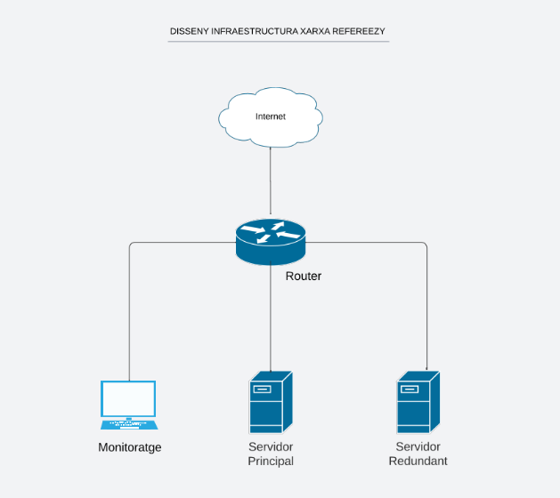
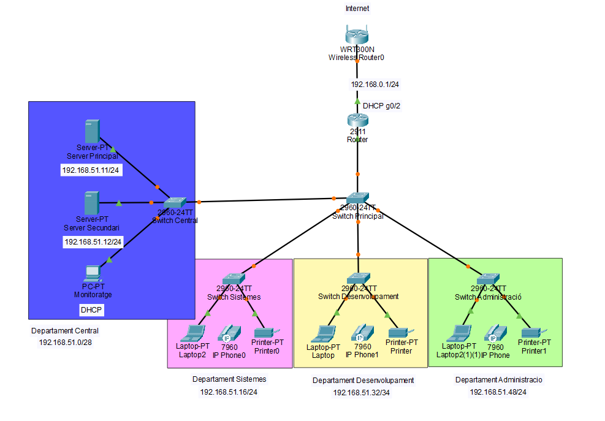

# Infraestructura de xarxa de Refereezy

## Disseny Inicial de la infraestructura de xarxa

## Simulació de la infraesturctura a Packet tracer

## Anàlisi de la xarxa

La xarxa dissenyada per a Refereezy segueix una estructura escalable i segura, pensada per donar suport a les necessitats actuals i futures de l’empresa en cas d'expansió o de debilitats. Aquesta infraestructura permet una gestió eficient dels recursos, una distribució clara per departaments i una fàcil ampliació, facilitant la gestió d'usuaris, permisos d'accés, responsabilitats, etc.

### Topologia de xarxa

#### Estructura en estrella jeràrquica

La xarxa segueix una topologia en estrella jeràrquica amb un Switch Principal (core) que connecta amb quatre switches secundaris, cadascun assignat a un departament específic:

- Switch Central
- Switch Sistemes
- Switch Desenvolupament
- Switch Administració

- Aquest model ofereix:
    - Millor rendiment
    - Facilitats de manteniment
    - Fàcil aïllament d’incidències

### Segmentació per departaments

#### Assignació d’adreces IP

Cada departament disposa d’una subxarxa pròpia, facilitant la segmentació i control del trànsit:

Departament	Subxarxa
Central	192.168.51.0/28
Sistemes	192.168.51.16/24
Desenvolupament	192.168.51.32/34
Administració	192.168.51.48/24

#### Avantatges

La infraestructura de xarxa de Refereezy segueix un disseny modular, segur i escalable, ideal per a una empresa tecnològica en creixement. Aquest sistema garanteix rendiment, mantenibilitat i flexibilitat, permetent integrar fàcilment noves funcionalitats i equips.

Els servidors estan ubicats al Departament Central, i inclouen un servidor principal i un de secundari amb adreces IP fixes, cosa que assegura estabilitat i disponibilitat dels serveis més crítics. També s’hi troba un PC que actua com a servidor DHCP per a la resta de la xarxa, assignant adreces IP dinàmiques als dispositius dels usuaris.

Aquest model centralitzat permet un millor control de la infraestructura i simplifica tasques com la configuració, actualització i seguretat dels sistemes.

La sortida a Internet està prevista amb una configuració NAT (traducció d’adreces), que protegeix la xarxa interna i assegura l’ús compartit d’una IP pública.

Cada departament disposa de dispositius adaptats a les seves funcions. Això reflecteix una infraestructura moderna que combina serveis multimèdia (VoIP) i perifèrics compartits.

#### Escalabilitat i visió de futur

Un dels punts forts d’aquesta xarxa és la seva capacitat d’escalabilitat. L’arquitectura modular i segmentada permet afegir nous dispositius, departaments o serveis sense necessitat de redissenyar completament la infraestructura. Aquesta flexibilitat és clau en un entorn com el de Refereezy, on es preveu un creixement progressiu a mesura que el projecte evoluciona.

A més, la xarxa ja està preparada per implementar VLANs, llistes de control d’accés (ACLs) i altres mecanismes avançats que podrien ser útils en fases posteriors del desenvolupament del projecte.

