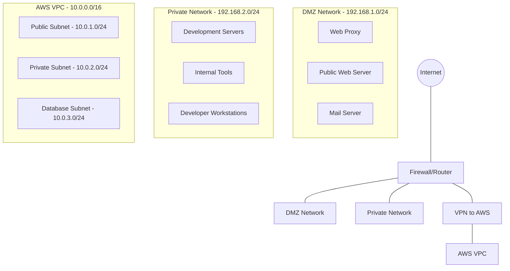

# Network Configuration

## Network Architecture

This document details the network architecture and configuration for the Refereezy platform infrastructure.

## Overview

The Refereezy platform uses a multi-tier network architecture designed for security, reliability, and performance. The network spans multiple environments including cloud infrastructure and on-premises components.



## Network Segments

### DMZ Network (192.168.1.0/24)

The DMZ (Demilitarized Zone) hosts services that need to be accessible from the internet:

| Service | IP Address | Purpose |
|---------|------------|---------|
| Web Proxy | 192.168.1.10 | Reverse proxy for public services |
| Public Web Server | 192.168.1.20 | Hosting public website and documentation |
| Mail Server | 192.168.1.30 | Email services |

### Private Network (192.168.2.0/24)

The private network hosts internal development and administrative services:

| Service | IP Address | Purpose |
|---------|------------|---------|
| Development Server 1 | 192.168.2.10 | Staging environment |
| Development Server 2 | 192.168.2.11 | Test environment |
| Internal Tools Server | 192.168.2.20 | CI/CD, monitoring, and management tools |
| Developer Workstations | 192.168.2.100-150 | DHCP range for developer machines |

### AWS VPC (10.0.0.0/16)

The AWS Virtual Private Cloud hosts the production environment:

| Subnet | CIDR | Purpose |
|--------|------|---------|
| Public Subnet | 10.0.1.0/24 | Load balancers and public-facing services |
| Private Subnet | 10.0.2.0/24 | Application servers |
| Database Subnet | 10.0.3.0/24 | Database servers and caching services |

## Router Configuration

### Main Router/Firewall

The primary router uses pfSense with the following configuration:

#### Interfaces

| Interface | Network | Description |
|-----------|---------|-------------|
| WAN | DHCP (ISP assigned) | Connection to internet |
| LAN1 | 192.168.1.0/24 | DMZ network |
| LAN2 | 192.168.2.0/24 | Private network |
| VPN1 | 10.10.10.0/24 | VPN tunnel to AWS |

#### Firewall Rules

1. **WAN Interface Rules**
   - Allow established connections
   - Allow HTTP/HTTPS to DMZ web server
   - Allow SMTP/SMTPS to DMZ mail server
   - Block all other incoming traffic

2. **DMZ Interface Rules**
   - Allow HTTP/HTTPS from anywhere
   - Allow traffic to Private network on specific ports
   - Allow DNS/NTP queries to specified servers
   - Block all other outgoing traffic

3. **Private Network Rules**
   - Allow all outgoing traffic to DMZ and internet
   - Allow VPN traffic to AWS
   - Block all incoming traffic except from DMZ on specific ports

#### NAT Configuration

1. **Port Forwarding**
   - HTTP (80) → 192.168.1.10:80
   - HTTPS (443) → 192.168.1.10:443
   - SMTP (25) → 192.168.1.30:25
   - SMTPS (465) → 192.168.1.30:465

2. **Outbound NAT**
   - All internal networks use WAN IP for outgoing traffic

## VPN Configuration

### AWS Site-to-Site VPN

The VPN connecting the on-premises network to AWS is configured as follows:

1. **Router Configuration**
   ```
   # IPsec Phase 1 Configuration
   set security ipsec vpn aws-vpn ike version 2
   set security ipsec vpn aws-vpn ike authentication-method pre-shared-keys
   set security ipsec vpn aws-vpn ike pre-shared-key "SecureKeyHere"
   set security ipsec vpn aws-vpn ike encryption-algorithm aes-256-cbc
   set security ipsec vpn aws-vpn ike dh-group group14
   
   # IPsec Phase 2 Configuration
   set security ipsec vpn aws-vpn ipsec protocol esp
   set security ipsec vpn aws-vpn ipsec authentication-algorithm hmac-sha-256-128
   set security ipsec vpn aws-vpn ipsec encryption-algorithm aes-256-cbc
   ```

2. **AWS Configuration**
   - AWS Customer Gateway IP: [WAN Public IP]
   - Virtual Private Gateway attached to VPC
   - Static Routes:
     - 192.168.1.0/24
     - 192.168.2.0/24

3. **Routing Configuration**
   - On-premises routes to 10.0.0.0/16 via VPN
   - AWS routes to 192.168.0.0/16 via VPN

## DNS Configuration

### Internal DNS

The internal DNS server is hosted at 192.168.2.5 with the following zones:

1. **refereezy.local**
   - Used for internal development resources
   - Split-horizon DNS (different views for internal vs. external clients)

2. **Main Records**
   - dev.refereezy.local → 192.168.2.10
   - test.refereezy.local → 192.168.2.11
   - tools.refereezy.local → 192.168.2.20
   - mail.refereezy.local → 192.168.1.30

### External DNS

External DNS is managed through AWS Route53:

1. **refereezy.com Zone**
   - www.refereezy.com → CloudFront Distribution
   - api.refereezy.com → Application Load Balancer
   - docs.refereezy.com → S3 Static Website / CloudFront

2. **Mail Records**
   - MX: mail.refereezy.com (Priority 10)
   - SPF: "v=spf1 ip4:203.0.113.0/24 ~all"
   - DKIM: Generated key records
   - DMARC: "v=DMARC1; p=reject; rua=mailto:dmarc@refereezy.com"

## DHCP Configuration

### Private Network DHCP

DHCP for the developer workstations is configured as follows:

```
subnet 192.168.2.0 netmask 255.255.255.0 {
  range 192.168.2.100 192.168.2.150;
  option domain-name-servers 192.168.2.5;
  option domain-name "refereezy.local";
  option routers 192.168.2.1;
  option broadcast-address 192.168.2.255;
  default-lease-time 600;
  max-lease-time 7200;
}
```

## Load Balancing

### Web Proxy Load Balancing

Nginx is used as a reverse proxy for load balancing:

```nginx
upstream backend_servers {
    server 192.168.2.10:8080 weight=3;
    server 192.168.2.11:8080 weight=1 backup;
}

server {
    listen 80;
    server_name staging.refereezy.local;

    location / {
        proxy_pass http://backend_servers;
        proxy_set_header Host $host;
        proxy_set_header X-Real-IP $remote_addr;
        proxy_set_header X-Forwarded-For $proxy_add_x_forwarded_for;
        proxy_set_header X-Forwarded-Proto $scheme;
    }
}
```

## Security Measures

### Firewall Rules

1. **External Firewall Rules**
   - Allow HTTP/HTTPS to web servers
   - Allow SMTP/SMTPS to mail server
   - Allow VPN traffic
   - Drop all other incoming traffic
   - Log all dropped packets

2. **Network Segmentation**
   - Strict separation between DMZ and internal networks
   - Database servers isolated in separate subnet
   - Developer access restricted to private network

### Intrusion Detection/Prevention

Suricata IDS/IPS is deployed with the following configuration:

```yaml
# Suricata primary configuration
vars:
  address-groups:
    HOME_NET: "[192.168.0.0/16,10.0.0.0/8]"
    EXTERNAL_NET: "!$HOME_NET"
```

## Monitoring

### Network Monitoring

Network traffic is monitored using:

1. **Prometheus + Grafana**
   - Network device metrics
   - Bandwidth utilization
   - Connection statistics

2. **Alert Configuration**
   ```yaml
   # Prometheus alert rule
   groups:
   - name: network-alerts
     rules:
     - alert: HighNetworkTraffic
       expr: sum(rate(node_network_transmit_bytes_total[5m])) > 100000000
       for: 10m
       labels:
         severity: warning
       annotations:
         summary: "High network traffic detected"
         description: "Network traffic is above 100Mbps for 10 minutes"
   ```

## Backup Connectivity

### Failover Configuration

1. **Dual WAN Setup**
   - Primary ISP: Fiber connection
   - Secondary ISP: Cable connection
   - Automatic failover if primary connection fails

2. **Failover Script**
   ```bash
   #!/bin/bash
   # Check connectivity
   ping -c 5 8.8.8.8 > /dev/null 2>&1
   if [ $? -ne 0 ]; then
     # Primary connection failed, switch to backup
     logger "Primary connection failed, switching to backup"
     ifdown wan0
     ifup wan1
     # Notify admin
     mail -s "Network failover activated" admin@refereezy.com
   fi
   ```

## Troubleshooting Procedures

### Common Network Issues

1. **VPN Connection Issues**
   - Check firewall rules on both ends
   - Verify IPsec phase 1 and 2 settings
   - Ensure routing tables are correctly configured

2. **DNS Resolution Problems**
   - Check DNS server availability
   - Verify DNS forwarders
   - Check split-horizon DNS configuration

3. **Connectivity Issues**
   - Run traceroute to identify where packets are being dropped
   - Check firewall logs for blocked connections
   - Verify NAT configuration for internal services

## Network Documentation

### Network Diagram

Detailed network diagram available in the Packet Tracer directory:
- `/sys-admin/packet tracer/diagramas/network-topology.pkt`

### IP Address Allocation

Complete IP address allocation spreadsheet:
- `/sys-admin/docs/ip-allocation.xlsx`

### Change Management

All network changes are documented in:
- `/sys-admin/docs/network-changes.md`

---

*Note for documentation contributors: Add detailed router configurations, firewall rule exports, and network maps. Include troubleshooting guides for common network issues and recovery procedures for network failures.*
