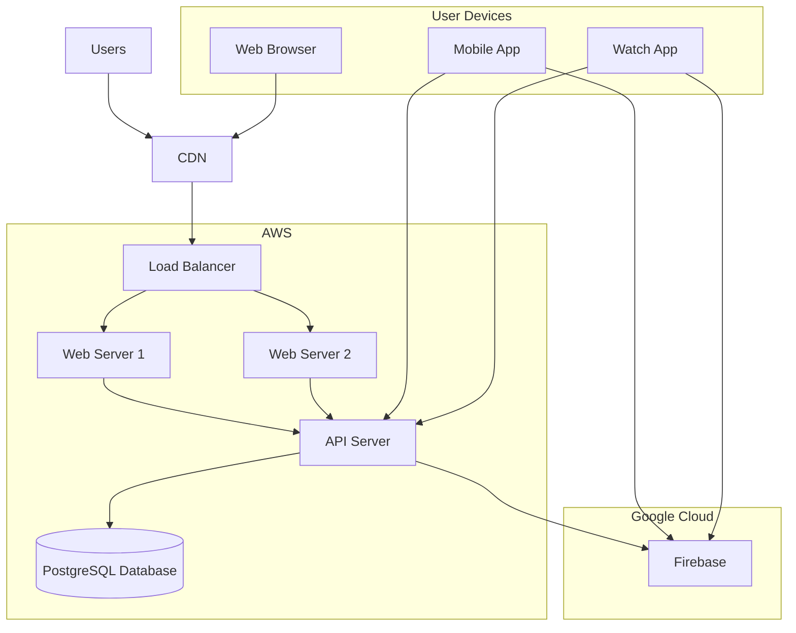

# Infrastructure Overview

## Refereezy Infrastructure

This document provides an overview of the infrastructure used to host and run the Refereezy platform. Our infrastructure is designed for reliability, security, and scalability.

## Infrastructure Diagram

## Server Environment

### Production Servers

| Server | Role | Configuration | Location |
|--------|------|--------------|----------|
| Server 1 | Web & Static Content | 4 vCPU, 8GB RAM, 50GB SSD | AWS EU-West |
| Server 2 | API & Application | 8 vCPU, 16GB RAM, 100GB SSD | AWS EU-West |
| Mail Server | Email Services | 2 vCPU, 4GB RAM, 20GB SSD | AWS EU-West |

### Database Server

PostgreSQL database hosted on AWS RDS with the following specifications:
- Instance type: db.t3.large
- Storage: 100GB gp2 SSD with automatic scaling
- Multi-AZ deployment for high availability

### Cloud Services

- **Firebase**: Used for real-time data synchronization and document storage
- **AWS S3**: Storage for static assets and backups
- **CloudFront**: CDN for delivering static content
- **CloudWatch**: Monitoring and logging

## Network Architecture

### Public Subnet

- Load balancer
- Web servers
- bastion host

### Private Subnet

- Application servers
- Database
- Internal services

### Security Groups

- **Web Security Group**: Allows HTTP/HTTPS
- **API Security Group**: Restricted access for API endpoints
- **Database Security Group**: Allows connections only from API servers
- **Management Security Group**: SSH access via bastion host only

## Deployment Strategy

### CI/CD Pipeline

We use GitHub Actions for continuous integration and deployment:

1. Code is pushed to GitHub
2. Automated tests are run
3. Docker images are built and pushed to registry
4. Infrastructure is updated via Terraform
5. New versions are deployed to staging environment
6. Upon approval, changes are deployed to production

### Blue-Green Deployment

For zero-downtime updates, we employ blue-green deployment:

1. New version is deployed to inactive environment
2. Tests are performed on the new environment
3. Once verified, traffic is switched to the new environment
4. Old environment is kept as fallback

## Backup and Recovery

### Database Backups

- Daily automated backups retained for 30 days
- Point-in-time recovery enabled
- Backup verification performed weekly

### Disaster Recovery

- Cross-region replication for critical data
- Documented recovery procedures
- Regular disaster recovery testing

## Monitoring and Alerting

### Monitoring Systems

- **AWS CloudWatch**: Server and application metrics
- **Grafana**: Visualization and dashboards
- **Prometheus**: Metrics collection
- **ELK Stack**: Log aggregation and analysis

### Alert Configuration

- Critical alerts: Immediate notification via SMS and email
- Warning alerts: Email notification
- Daily health report sent to administrators

## Security Measures

- Web Application Firewall (WAF)
- DDoS protection
- SSL/TLS encryption for all traffic
- Regular security audits and penetration testing
- Automated vulnerability scanning

---

*Note: This document should be expanded with detailed network diagrams, specific server configurations, and step-by-step procedures for common administration tasks. Include contact information for the responsible team members and escalation procedures.*
