# Configuració de la xarxa a Packet Tracer

## Router

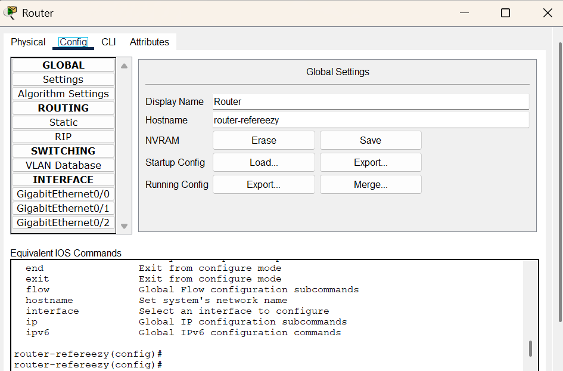{width="60%"}

**Hostname**
```bash
Router> enable
Router# configure terminal
Enter configuration commands, one per line.  End with CNTL/Z.
Router(config)# hostname router-refereezy
```

### Xarxa WAN

1. **Configuració NAT per establir connexió amb Internet**:
```bash=cisco
Router> enable
Router# conf t
Router(config)# interface gigabitEthernet 0/2
Router(config-if)# ip address dhcp
Router(config-if)# no shutdown
Router(config-if)# exit

Router(config)# ip nat inside source list 1 interface gigabitEthernet 0/2 overload
Router(config)# access-list 1 permit 192.168.51.0 0.0.0.255
Router(config)# ip route 0.0.0.0 0.0.0.0 200.0.0.1
```


### Xarxa LAN

| Departamento    | VLAN ID | Subred           | Rango de IPs       |
| --------------- | ------- | ---------------- | ------------------ |
| Central   | 10      | 192.168.51.0/28  | 192.168.51.1 – 14  |
| Sistemes        | 20      | 192.168.51.16/28 | 192.168.51.17 – 30 |
| Desenvolupament | 30      | 192.168.51.32/28 | 192.168.51.33 – 46 |
| Administració   | 40      | 192.168.51.48/28 | 192.168.51.49 – 62 |

1. Afegim una IP de la xarxa 192.168.51.0/24:

```bash=cisco
router-refereezy(config)# 
    interface gigabitEthernet 0/0
    ip address 192.168.51.1 255.255.255.0
    no shutdown
```

2. VLAN's:

```bash
Router> enable
Router# configure terminal

interface GigabitEthernet0/0.10
 encapsulation dot1Q 10
 ip address 192.168.51.1 255.255.255.240
 ip helper-address 192.168.51.11
 no shutdown
 exit

interface GigabitEthernet0/0.20
 encapsulation dot1Q 20
 ip address 192.168.51.17 255.255.255.240
 ip helper-address 192.168.51.11
 no shutdown
 exit

interface GigabitEthernet0/0.30
 encapsulation dot1Q 30
 ip address 192.168.51.33 255.255.255.240
 ip helper-address 192.168.51.11
 no shutdown
 exit

interface GigabitEthernet0/0.40
 encapsulation dot1Q 40
 ip address 192.168.51.49 255.255.255.240
 ip helper-address 192.168.51.11
 no shutdown
 exit

interface GigabitEthernet0/0
 no shutdown
 exit
```

2. **Servidor DHCP per a cada subxarxa en el Router**:
```bash
# Excluïm la IP dels servers
## Departament Central
Router(config)# 
ip dhcp excluded-address 192.168.51.1 
ip dhcp excluded-address 192.168.51.11 
ip dhcp excluded-address 192.168.51.12

# Excluïm IP's de impresora, telefonía, etc...
## Departament de Sistemes
ip dhcp excluded-address 192.168.51.17 
ip dhcp excluded-address 192.168.51.21

## Departament de Desenvolupament
ip dhcp excluded-address 192.168.51.33 
ip dhcp excluded-address 192.168.51.37

## Departament de Administració 
ip dhcp excluded-address 192.168.51.49 
ip dhcp excluded-address 192.168.51.53

# ! VLAN 10 - Panel Central
Router(config)# 
ip dhcp pool VLAN10
 network 192.168.51.0 255.255.255.240
 default-router 192.168.51.1
 dns-server 8.8.8.8
 exit

# ! VLAN 20 - Sistemes
Router(config)# 
ip dhcp pool VLAN20
 network 192.168.51.16 255.255.255.240
 default-router 192.168.51.17
 dns-server 8.8.8.8
 exit

# ! VLAN 30 - Desenvolupament
Router(config)# 
ip dhcp pool VLAN30
 network 192.168.51.32 255.255.255.240
 default-router 192.168.51.33
 dns-server 8.8.8.8
 exit

# ! VLAN 40 - Administració
Router(config)# 
ip dhcp pool VLAN40
 network 192.168.51.48 255.255.255.240
 default-router 192.168.51.49
 dns-server 8.8.8.8
 exit
 
```

Sempre després de acabar de fer configuracions:
```bash
copy running-config startup-config
```

## Switch Principal

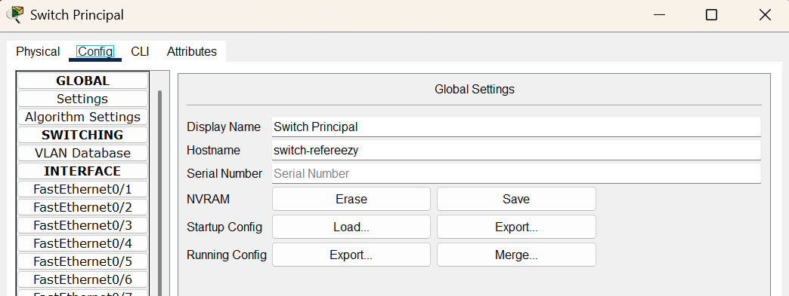{width="60%"}

```bash
Switch>enable
Switch#configure terminal
Enter configuration commands, one per line.  End with CNTL/Z.
Switch(config)#hostname switch-refereezy
switch-refereezy(config)#
```

### Subneting

Per fer la divisió de la xarxa, tenim en compte el número de hosts que hi haurà a cada rang. En el nostre cas, és suficient amb 14 hosts per Departament, utilitzarem la máscara 255.255.255.240 (/28).

Xarxa per departament:

- Xarxa del Departament Central: 192.168.51.0/28 
    Primer host: 192.168.51.1
    Últim host: 192.168.51.14
    Broadcast: 192.168.51.15

- Departament de Sistemes: 192.168.51.16/28
    Primer host: 192.168.51.17
    Últim host: 192.168.51.30
    Broadcast: 192.168.51.31

- Departament de Desenvolupament: 192.168.51.32/28
    Primer host: 192.168.51.33
    Últim host: 192.168.51.46
    Broadcast: 192.168.51.47
    
- Departament d'Administració: 192.168.51.16/28
    Primer host: 192.168.51.49
    Últim host: 192.168.51.62
    Broadcast: 192.168.51.63


| Departamento    | VLAN ID | Subred           | Rango de IPs       |
| --------------- | ------- | ---------------- | ------------------ |
| Panel Central   | 10      | 192.168.51.0/28  | 192.168.51.1 – 14  |
| Sistemes        | 20      | 192.168.51.16/28 | 192.168.51.17 – 30 |
| Desenvolupament | 30      | 192.168.51.32/28 | 192.168.51.33 – 46 |
| Administració   | 40      | 192.168.51.48/28 | 192.168.51.49 – 62 |


1. Creo les VLAN's, una per departament:

```bash
Switch> enable
Switch# configure terminal

vlan 10
 name Central
exit
vlan 20
 name Sistemes
exit
vlan 30
 name Desenvolupament
exit
vlan 40
 name Administracio
exit


# ! Port al router
interface fa0/24
 switchport mode trunk
exit

# ! Port al switch-central
interface fa0/1
 switchport mode trunk
exit

# ! Port al switch-sistemes
interface fa0/2
 switchport mode trunk
exit

# ! Port al switch-desenvolupament
interface fa0/3
 switchport mode trunk
exit

# ! Port al switch-administracio
interface fa0/4
 switchport mode trunk
exit

```

Sempre després de acabar de fer configuracions:
```bash
copy running-config startup-config
```

## Departament central

### Switch Central

```bash
enable
configure terminal

# Modifiquem el nom
hostname switch-central

vlan 10
 name Central
exit

# ! Ports dels disposistius del sistema Central
interface range fa0/1 - 23
 switchport mode access
 switchport access vlan 10
exit

# ! Port que va al switch-principal
interface fa0/24
 switchport mode trunk
exit

```

Sempre després de acabar de fer configuracions:
```bash
copy running-config startup-config
```

### Monitoratge

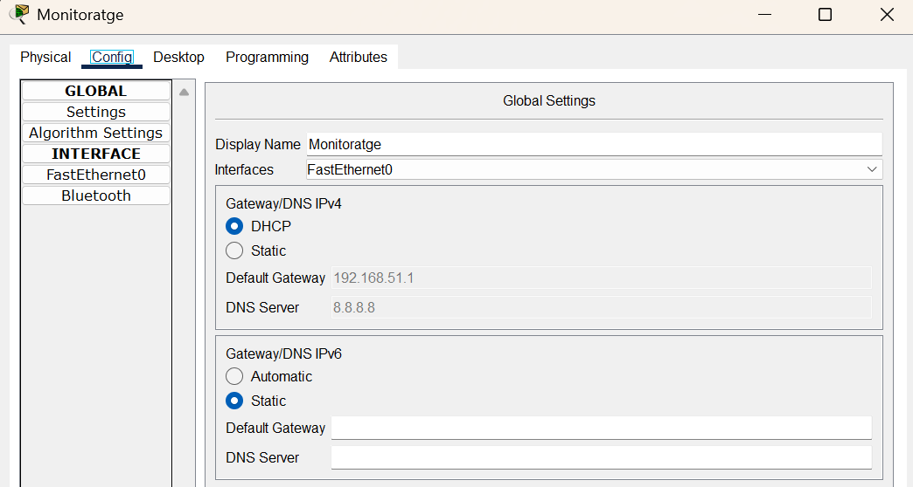{width="60%"}
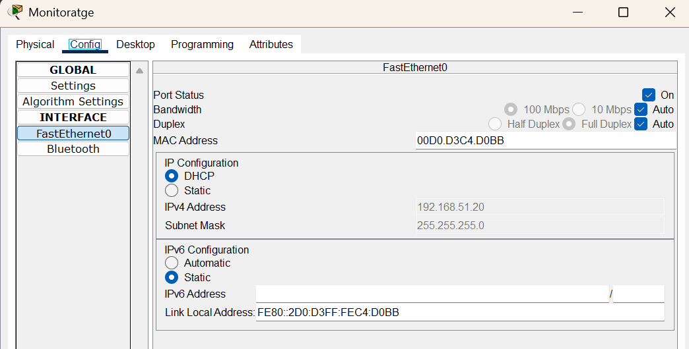{width="60%"}

### Server Principal

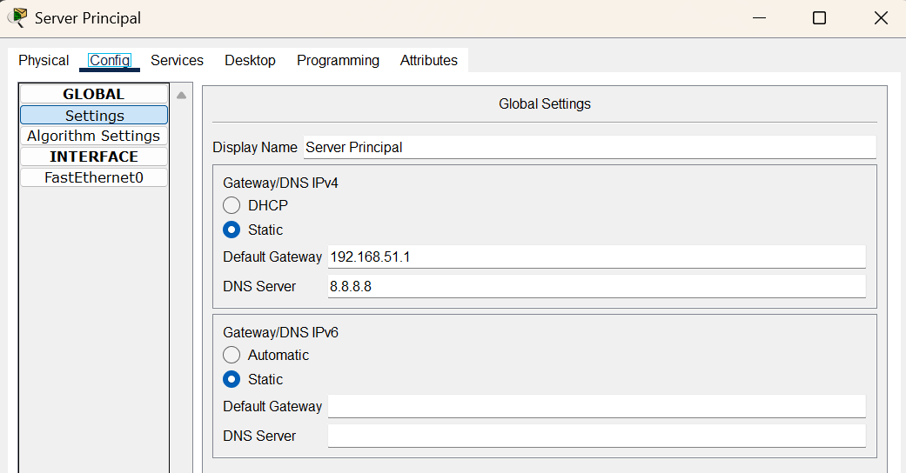{width="60%"}
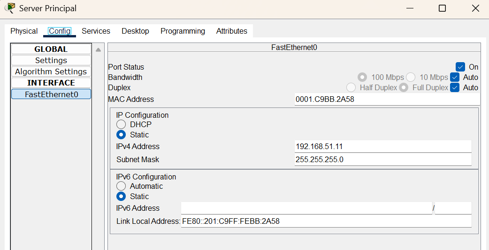{width="60%"}

#### HTTPS

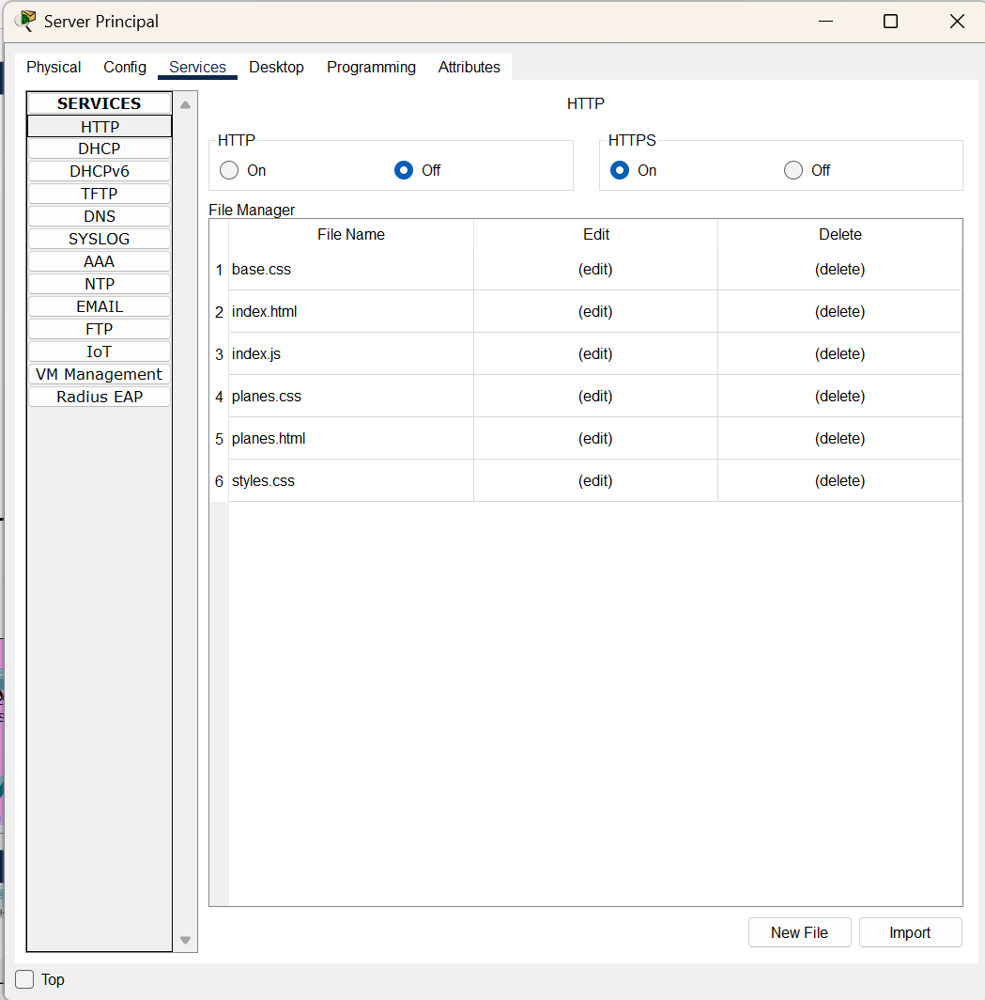{width="60%"}

Si entrem des d'un portàtil de la xarxa al navegador web amb la IP del Servidor Web podem veure la nostra aplicació web desplegada:

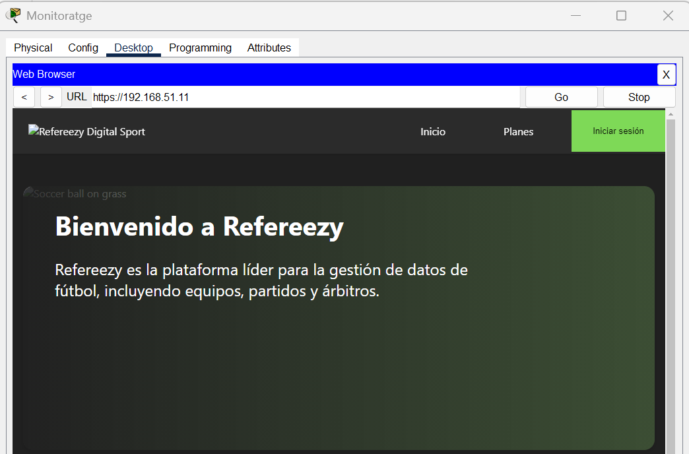{width="60%"}

#### DNS

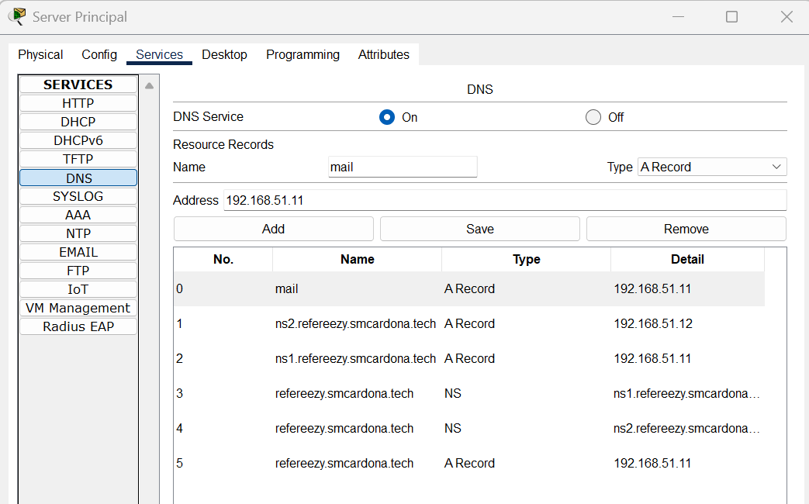{width="60%"}

Si provem d'entrar a la nostra pàgina web, ara utilitzant el domini, podrem observar que fa la resolució:

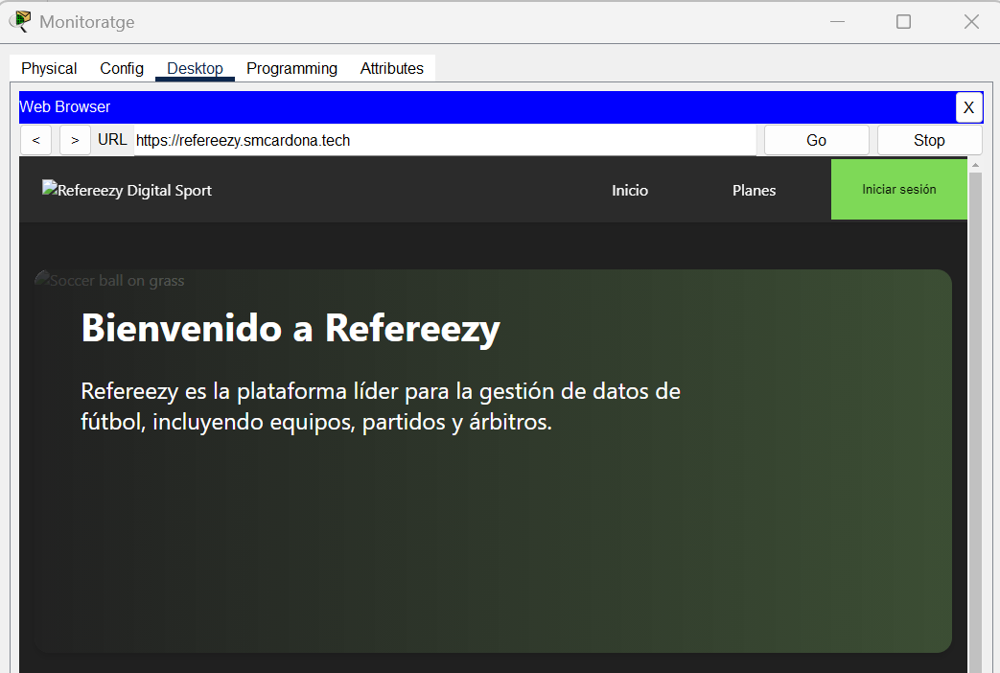{width="60%"}

#### Servidor de correu

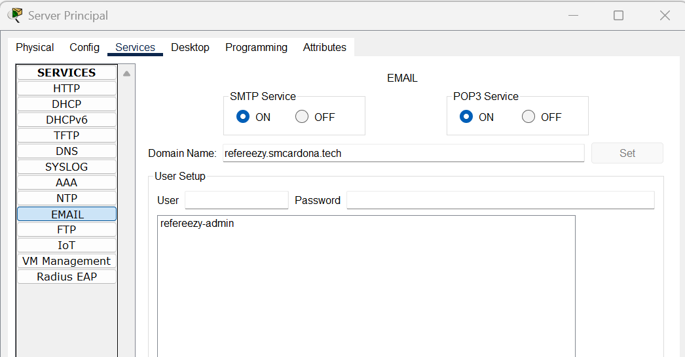{width="60%"}

### Server Secundari (redundant)

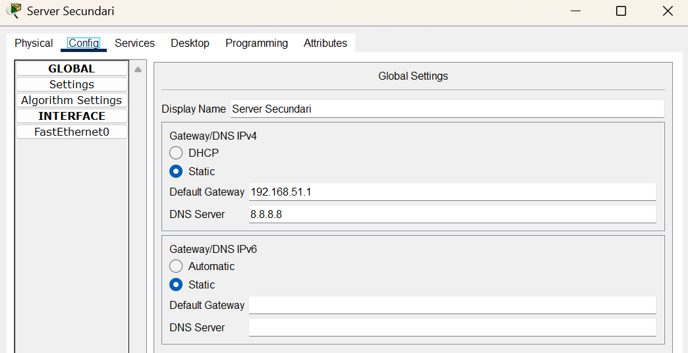{width="60%"}
{width="60%"}


En el servidor tenim tots els serveis del server principal duplicats per tenir redundància de sistema en cas de caiguda d'algún.


## Departament de Sistemes

### Switch Sistemes

```bash
enable
configure terminal

# Modifiquem el nom
hostname switch-sistemes

vlan 20
 name Sistemes

# ! Ports dels disposistius connectats al switch
interface range fa0/1 - 23
 switchport mode access
 switchport access vlan 20

# ! Port que va al switch-principal
interface fa0/24
 switchport mode trunk
exit

```

Sempre després de acabar de fer configuracions:
```bash
copy running-config startup-config
```

## Departament de Desenvolupament

### Switch Devel

```bash
enable
configure terminal

# Modifiquem el nom
hostname switch-devel

vlan 30
 name Devel

# ! Ports dels disposistius connectats al switch
interface range fa0/1 - 23
 switchport mode access
 switchport access vlan 30

# ! Port que va al switch-principal
interface fa0/24
 switchport mode trunk
exit

```

Sempre després de acabar de fer configuracions:
```bash
copy running-config startup-config
```

## Departament d'Administració

### Switch Administració

```bash
enable
configure terminal

# Modifiquem el nom
hostname switch-administracio

vlan 40
 name Administracio

# ! Ports dels disposistius connectats al switch
interface range fa0/1 - 23
 switchport mode access
 switchport access vlan 40

# ! Port que va al switch-principals
interface fa0/24
 switchport mode trunk
exit
```

Sempre després de acabar de fer configuracions:
```bash
copy running-config startup-config
```