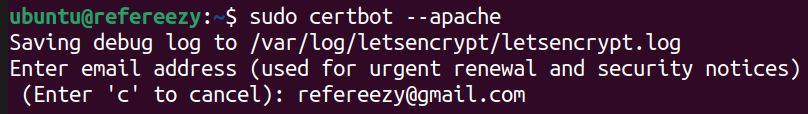

## GIT

```bash
sudo apt install git

# Generem una clau pública i privada per poder-nos connectar per SSH.
ssh-keygen 

# Clonem el repositori del projecte amb SSH.
# Afegim la clau pública al registre de claus del repositori.
git clone git@github.com:refereezy/refereezy-project.git
# Ens identifiquem.
```

## DOCKER

Pel desplegament de la API, el socket i la documentació, fem servir contenidors.

**Instal·lacio:**

```bash
sudo apt update
sudo apt install -y apt-transport-https curl
curl -fsSL https://download.docker.com/linux/ubuntu/gpg | sudo gpg --dearmor -o /etc/apt/keyrings/docker.gpg
echo "deb [arch=$(dpkg --print-architecture) signed-by=/etc/apt/keyrings/docker.gpg] https://download.docker.com/linux/ubuntu $(. /etc/os-release && echo "$VERSION_CODENAME") stable" | sudo tee /etc/apt/sources.list.d/docker.list > /dev/null
sudo apt update
sudo apt install -y docker-ce docker-ce-cli containerd.io docker-buildx-plugin docker-compose-plugin
sudo systemctl is-active docker
sudo docker run hello-world
sudo usermod -aG docker ${USER}
```

Pel senzill desplegament dels contenidors fem servir scripts (Els podeu trobar a la carpeta de [/scripts al nostre repositori de Github](https://github.com/refereezy/refereezy-project/tree/main/scripts) tant per a Windows com per a Linux):

**rebuild_all_containers.sh**
```bash
#!/bin/bash

# Script para reconstruir todas las imagenes Docker y reiniciar los contenedores
# para el proyecto Refereezy

# Directorio base del proyecto (relativo al directorio del script)
BASE_DIR="$(cd "$(dirname "${BASH_SOURCE[0]}")/.." && pwd)"
SCRIPT_DIR="$BASE_DIR/scripts"

# Verificar si se ha proporcionado un argumento para el perfil
PROFILE=${1:-all}

echo "Perfil seleccionado: $PROFILE"
echo ""

echo "=== Deteniendo los contenedores actuales ==="
cd "$SCRIPT_DIR"
sudo docker-compose down

# Eliminar contenedores existentes para evitar conflictos de nombres
echo "=== Eliminando contenedores existentes que puedan causar conflictos ==="
sudo docker rm -f docu sockets testdb testapi api 2>/dev/null || true
echo "Contenedores eliminados o no existentes"

echo "=== Reconstruyendo las imagenes ==="

# Reconstruir imagen para mkdocs (Documentation/Dockerfile)
echo "Reconstruyendo mi-mkdocs..."
cd "$BASE_DIR/Documentation"
sudo docker build -t mi-mkdocs .

# Reconstruir imagen para sockets (APPS/web/Dockerfile)
echo "Reconstruyendo socket-server:latest..."
cd "$BASE_DIR/APPS/web"
sudo docker build -t socket-server:latest .

# Determinar qué imagenes construir según el perfil
if [ "$PROFILE" = "all" ]; then
    BUILD_TEST=yes
    BUILD_PROD=yes
elif [ "$PROFILE" = "test" ]; then
    BUILD_TEST=yes
    BUILD_PROD=no
elif [ "$PROFILE" = "prod" ]; then
    BUILD_TEST=no
    BUILD_PROD=yes
else
    echo "Perfil no reconocido. Opciones validas: all, test, prod"
    exit 1
fi

if [ "$BUILD_TEST" = "yes" ]; then
    # Reconstruir imagen para test-db (API/test-db/Dockerfile)
    echo "Reconstruyendo test-db:latest..."
    cd "$BASE_DIR/API/test-db"
    sudo docker build -t test-db:latest .

    # Reconstruir imagen para test-api (API/Dockerfile)
    echo "Reconstruyendo api-app:test..."
    cd "$BASE_DIR/API"
    sudo docker build -t api-app:test .
else
    echo "Omitiendo la construcción de imagenes de prueba..."
fi

if [ "$BUILD_PROD" = "yes" ]; then
    # Reconstruir imagen para api (API/Dockerfile)
    echo "Reconstruyendo api-app:latest..."
    cd "$BASE_DIR/API"
    sudo docker build -t api-app:latest .
else
    echo "Omitiendo la construcción de imagenes de producción..."
fi

# Eliminar imagenes no utilizadas
echo "Limpiando imagenes no utilizadas..."
sudo docker image prune -f

# Creando redes si no existen
echo "=== Creando redes si no existen ==="
sudo docker network create internal 2>/dev/null || true

# Reiniciar contenedores
echo "=== Reiniciando contenedores ==="
cd "$SCRIPT_DIR"

if [ "$PROFILE" = "all" ]; then
    echo "Iniciando todos los contenedores..."
    sudo docker-compose --profile common --profile test --profile prod up -d
elif [ "$PROFILE" = "test" ]; then
    echo "Iniciando contenedores comunes y de prueba..."
    sudo docker-compose --profile common --profile test up -d
elif [ "$PROFILE" = "prod" ]; then
    echo "Iniciando contenedores comunes y de producción..."
    sudo docker-compose --profile common --profile prod up -d
fi

echo "=== Proceso completado ==="
echo "Los contenedores han sido reconstruidos y reiniciados para el perfil: $PROFILE"

# Mostrar contenedores en ejecución
sudo docker ps

```


**docker-compose.yml**
```bash
version: "3.8"

services:
  # mkdocs - Dockerfile ubicado en: ../Documentation/Dockerfile
  mkdocs:
    image: mi-mkdocs
    container_name: docu
    restart: unless-stopped
    ports:
      - "8000:${MKDOCS_PORT}"
    volumes:
      - ../Documentation:/docs
    networks:
      - internal
    profiles: [common, test, prod]

  # socket.io api + real time web - Dockerfile ubicado en: ../APPS/web/Dockerfile
  sockets:
    image: socket-server:latest
    container_name: sockets
    restart: unless-stopped
    ports:
      - "3000:${SOCKET_IO_PORT}"
    environment:
      - PORT=${SOCKET_IO_PORT}
      - FIREBASE_KEY=${FIREBASE_KEY}
      - FIREBASE_AUTH_DOMAIN=${FIREBASE_AUTH_DOMAIN}
      - FIREBASE_PROJECT_ID=${FIREBASE_PROJECT_ID}
      - FIREBASE_STORAGE_BUCKET=${FIREBASE_STORAGE_BUCKET}
      - FIREBASE_MESSAGING_SENDER_ID=${FIREBASE_MESSAGING_SENDER_ID}
      - FIREBASE_APP_ID=${FIREBASE_APP_ID}
      - FIREBASE_MEASUREMENT_ID=${FIREBASE_MEASUREMENT_ID}
      - REFEREEZY_API_URL=${REFEREEZY_API_URL}
    volumes:
      - ../APPS/web/src:/app/src
    networks:
      - internal
    profiles: [common, test, prod]
  # postgres testeo - Dockerfile ubicado en: ../API/test-db/Dockerfile
  test-db:
    image: test-db:latest
    container_name: testdb
    restart: unless-stopped
    ports:
      - "5433:${TEST_DB_PORT}"
    environment:
      - POSTGRES_USER=${TEST_DB_USER}
      - POSTGRES_PASSWORD=${TEST_DB_PASS}
    networks:
      - internal
    profiles: [test]

  # api testeo - Dockerfile ubicado en: ../API/Dockerfile
  test-api:
    image: api-app:test
    container_name: testapi
    restart: unless-stopped
    ports:
      - "8888:${API_PORT}"
    environment:
      - DB_USER=${TEST_DB_USER}
      - DB_PASSWORD=${TEST_DB_PASS}
      - DB_PORT=${TEST_DB_PORT}
      - DB_NAME=${TEST_DB_NAME}
      - DB_HOST=${TEST_DB_HOST}
    networks:
      - internal
    profiles: [test]
        # api prod - Dockerfile ubicado en: ../API/Dockerfile
  api:
    image: api-app:latest
    container_name: api
    restart: unless-stopped
    ports:
      - "8080:${API_PORT}"
    environment:
      - DB_USER=${DB_USER}
      - DB_PASSWORD=${DB_PASS}
      - DB_PORT=${DB_PORT}
      - DB_NAME=${DB_NAME}
      - DB_HOST=${DB_HOST}
    networks:
      - internal
    profiles: [prod]


networks:
  internal:
    name: internal
    external: true

```


## APACHE2

```bash
sudo apt install apache2

sudo apt update
sudo apt install certbot python3-certbot-apache -y

sudo certbot --apache

# Per renovar el certificat automàticament programant un cron:
sudo certbot renew --dry-run

```

{width="60%"}


```bash

sudo a2enmod proxy
sudo a2enmod proxy_http
sudo systemctl restart apache2

sudo nano /etc/apache2/sites-available/refereezy.conf
```

```
<IfModule mod_ssl.c>
<VirtualHost *:443>
        # The ServerName directive sets the request scheme, hostname and port that
        # the server uses to identify itself. This is used when creating
        # redirection URLs. In the context of virtual hosts, the ServerName
        # specifies what hostname must appear in the request's Host: header to
        # match this virtual host. For the default virtual host (this file) this
        # value is not decisive as it is used as a last resort host regardless.
        # However, you must set it for any further virtual host explicitly.
        #ServerName www.example.com

        ServerAdmin webmaster@localhost
        DocumentRoot /var/www/html

        # Available loglevels: trace8, ..., trace1, debug, info, notice, warn,
        # error, crit, alert, emerg.
        # It is also possible to configure the loglevel for particular
        # modules, e.g.
        #LogLevel info ssl:warn

        ErrorLog ${APACHE_LOG_DIR}/error.log
        CustomLog ${APACHE_LOG_DIR}/access.log combined

        # For most configuration files from conf-available/, which are
        # enabled or disabled at a global level, it is possible to
        # include a line for only one particular virtual host. For example the
        # following line enables the CGI configuration for this host only
        # after it has been globally disabled with "a2disconf".
        #Include conf-available/serve-cgi-bin.conf

        ServerName refereezy.smcardona.tech
        SSLEngine on
        SSLCertificateFile /etc/letsencrypt/live/refereezy.smcardona.tech/fullchain.pem
        SSLCertificateKeyFile /etc/letsencrypt/live/refereezy.smcardona.tech/privkey.pem
        Include /etc/letsencrypt/options-ssl-apache.conf

</VirtualHost>
</IfModule>
```

```bash
sudo a2dissite 000-default.conf
sudo a2ensite refereezy.conf
sudo systemctl reload apache2
```

## WireGuard

Descarreguem l'arxiu VPN amb el qual ens connectarem a la xarxa VPN on s'allotja la nostra infraestructura de xarxa (router, servidor...)

```bash
sudo apt install wireguard
sudo mv /path/to/downloads/isard-vpn.conf /etc/wireguard/
sudo wg-quick up isard-vpn
```

Per no tenir que habilitar la VPN cada vegada que entrem al sistema, afegim una tasca al systemd.
```bash
sudo nano /etc/systemd/system/wireguard-autostart.service
```

Contingut de l'arxiu del servei:
```sh
[Unit]
Description=Arrancar VPN Isard
After=network.target

[Service]
Type=simple
ExecStart=/usr/bin/wg-quick up /etc/wireguard/isard-vpn.conf
ExecStop=/usr/bin/wg-quick down /etc/wireguard/isard-vpn.conf
RemainAfterExit=yes

[Install]
WantedBy=multi-user.target
```
```bash
sudo systemctl enable wireguard-autostart.service
```

## Network-manager

```bash
sudo apt -y install network-manager
sudo apt -y install traceroute
```


