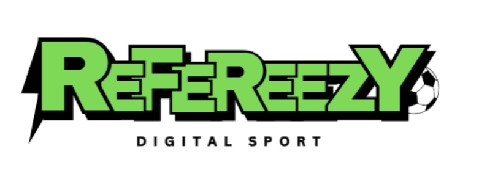

 

# Refereezy - Digitalitzem l'esport, automatitzem actes, proporcionem seguiment en directe.

> A modern platform for sports match management, referee reporting, and real-time match monitoring.

## About The Project

Refereezy is a comprehensive platform designed to revolutionize sports match management through digital innovation. Our system allows organizers to schedule private matches with their own players, enables referees to generate match reports in real-time, and provides live match monitoring through a web interface.

## Key Components

- **Website Portal**: Schedule matches, manage teams, and organize tournaments
- **Mobile App**: For referees to record match incidents and manage timekeeping
- **Watch App**: Companion app for smartwatches to quickly record incidents
- **Web App**: Real-time display of ongoing matches and match reports
- **API**: Backend system for data storage and management
- **Real-time System**: Firebase integration for instant updates across all platforms

## Team

This project is being developed by a team of 4 Higher Degree Computer Science students:

- **Santiago Muñoz** - Lead Developer
- **Ismael Younes** - Backend Developer
- **Anguelina Levchenko** - Frontend Developer
- **Jesus Guerrero** - Mobile Developer

## Documentation

For complete documentation, visit our [Documentation Portal](https://refereezy.smcardona.tech/docs/) or browse the `Documentation` folder in this repository.
