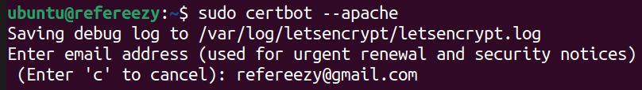

## GIT

```bash
sudo apt install git

# Generem una clau pública i privada per poder-nos connectar per SSH.
ssh-keygen 

# Clonem el repositori del projecte amb SSH.
# Afegim la clau pública al registre de claus del repositori.
git clone git@github.com:refereezy/refereezy-project.git
# Ens identifiquem.
```

## DOCKER

```bash
sudo apt update
sudo apt install -y apt-transport-https curl
curl -fsSL https://download.docker.com/linux/ubuntu/gpg | sudo gpg --dearmor -o /etc/apt/keyrings/docker.gpg
echo "deb [arch=$(dpkg --print-architecture) signed-by=/etc/apt/keyrings/docker.gpg] https://download.docker.com/linux/ubuntu $(. /etc/os-release && echo "$VERSION_CODENAME") stable" | sudo tee /etc/apt/sources.list.d/docker.list > /dev/null
sudo apt update
sudo apt install -y docker-ce docker-ce-cli containerd.io docker-buildx-plugin docker-compose-plugin
sudo systemctl is-active docker
sudo docker run hello-world
sudo usermod -aG docker ${USER}

```

## APACHE2

```bash
sudo apt install apache2

sudo apt update
sudo apt install certbot python3-certbot-apache -y

sudo certbot --apache

```



```bash

sudo a2enmod proxy
sudo a2enmod proxy_http
sudo systemctl restart apache2


```


## WireGuard

Descarreguem l'arxiu VPN amb el qual ens connectarem a la xarxa VPN on s'allotja la nostra infraestructura de xarxa (router, servidor...)

```bash
sudo apt install wireguard
sudo mv /path/to/downloads/isard-vpn.conf /etc/wireguard/
sudo wg-quick up isard-vpn
```

Per no tenir que habilitar la VPN cada vegada que entrem al sistema, afegim una tasca al systemd.
```bash
sudo nano /etc/systemd/system/wireguard-autostart.service
```

Contingut de l'arxiu del servei:
```s
[Unit]
Description=Arrancar VPN Isard
After=network.target

[Service]
Type=simple
ExecStart=/usr/bin/wg-quick up /etc/wireguard/isard-vpn.conf
ExecStop=/usr/bin/wg-quick down /etc/wireguard/isard-vpn.conf
RemainAfterExit=yes

[Install]
WantedBy=multi-user.target
```
```bash
sudo systemctl enable wireguard-autostart.service
```

## Network-manager

```bash
sudo apt -y install network-manager
sudo apt -y install traceroute
```

## Encender API

```bash
# Nos dirigimos a la carpeta donde se encuentra el fichero docker-compose.yaml
docker-compose up -d

