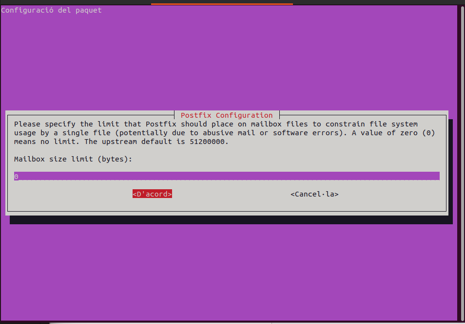
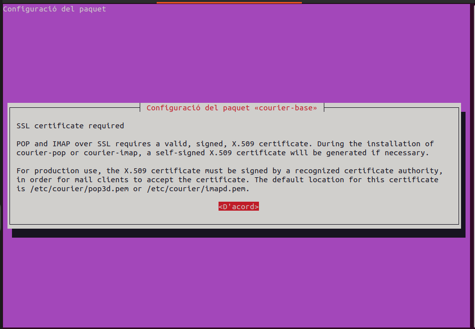

# CONFIGURACIÓ SERVER 1 (principal)

```bash
sudo apt -y update
sudo apt -y upgrade
```

## BBDD

```bash
# Instalem gestor de Base de dades i paquets addicionals
sudo apt install -y postgresql postgresql-contrib libpq-dev

# Verifiquem que s'ha fet correctament la instal·lació
psql --version

# Ens connectem a la base de dades com a root.
sudo -u postgres psql 

CREATE DATABASE refereezy;
CREATE USER admin WITH PASSWORD '******';
GRANT ALL PRIVILEGES ON DATABASE refereezy TO admin;

# Ens connectem amb l'usuari administrador creat per gestionar la BBDD.
psql -h localhost -U admin -d refereezy

CREATE USER arbitre with password 'jais-arbitro';

```

Perquè la API pugui accedir a la BBDD hem d'obrir les direccions d'escolta configurant:
```bash
sudo nano /etc/postgresl/14/main/postgresql.conf
```
I modifiquem la següent linia:
```bash
[...]
listen_addresses= '*'
[...]
```


## Servei WEB

```bash
sudo apt install apache2
```

## GIT

```bash
sudo apt install git

# Generem una clau pública i privada per poder connectar-nos al repositori per SSH. 
ssh-keyen

# Clonem el repositori del projecte amb SSH.
# Afegim la clau pública al registre de claus del repositori.
git clone git@github.com:refereezy/refereezy-project.git
# Ens identifiquem.
```

## DNS

### Instalar BIND9

```bash
sudo apt update
sudo apt install bind9
```

### Configuració zona

Configurem la zona per el domini refereezy.smcardona.lan, per fer la simulació de que tenim un domini real. El domini que utilitzem ja té un servidor DNS, i si fem servir el mateix, al fer la resolució de noms, apuntará a aquest, en comptes del nostre propi servidor DNS configurat en aquest apartat.

```bash
sudo nano /etc/bind/named.conf.local
```

```bash
zone "refereezy.smcardona.lan" {
                type primary;
                file "/etc/bind/db.refereezy.smcardona.lan";
                // default
                notify yes;
};

zone "51.168.192.in-addr.arpa" {
        type primary;
        file "/etc/bind/db.192.168.51";
        notify yes;
};
```

```bash
sudo nano /etc/bind/db.refereezy.smcardona.lan
```

```bash
$TTL 2d ; default TTL for zone
$ORIGIN refereezy.smcardona.lan. ; base domain-name

; Start of Authority RR defining the key characteristics of the zone

@       IN      SOA     ns1.refereezy.smcardona.lan. hostmaster.refereezy.smcardona.lan. (
                                2024093002 ; serial number
                                12h        ; refresh
                                15m        ; update retry
                                3w         ; expiry
                                2h         ; minimum
                                );

;       Registros NS
; name server RR for the domain
        IN      NS      ns1.refereezy.smcardona.lan.
; mail server RRs for the zone (domain)
     3w IN      MX 10   mail.refereezy.smcardona.lan.

; domain hosts includes NS and MX records defined above
ns1     IN      A       192.168.51.1
mail    IN      A       192.168.51.1
desktop IN      A        192.168.51.1
server-dhcp  IN      A        192.168.51.1

; aliases www (www server) to server
www     IN      CNAME   server.refereezy.smcardona.lan
salutacio       IN      TXT     'Hello World'
```

### Zona inversa

Configurem el servidor de dominis perquè resoleixi tant direccions IP's com noms de domini.

```bash
sudo nano /etc/bind/db.192.168.51
```

```bash
$TTL 2d
$ORIGIN 1.168.192.in.addr.arpa.

@       IN      SOA     ns1.refereezy.smcardona.lan. root.refereezy.smcardona.lan. (
                                2024093000 ;
                                12h
                                15m
                                3w
                                2h
                )
;
@       IN      NS      ns1refereezy.smcardona.lan.


; Registros PTR (inversos)
1      IN      PTR     ns1.refereezy.smcardona.lan.
1      IN      PTR     mail.refereezy.smcardona.lan.
1       IN      PTR     desktop.refereezy.smcardona.lan.
1      IN      PTR     server.refereezy.smcardona.lan.
1      IN      PTR     www.refereezy.smcardona.lan.

```

## MailServer Postfix

### Instalació

```bash
sudo apt install postfix
dpkg-reconfigure postfix # reconfigurar sense entrar als arxius de configuració

systemctl reload postfix
```

Al fer la instal·lació, ens apareixeran aquesta interfície gráfica per configurar el servei de correu fàcilment.Farem servir el domini **refereezy.smcardona.lan** per el servidor de correu.





Per comprovar que funciona, ens connectarem per telnet al port del SMTP, el 25.

```bash
netstat -tulnp | grep 25
```

 !!!!! CAMBIAR FOTO


Instal·lem el servidor IMAP (Internet Message Access Protocol)

```bash
sudo apt install courier-imap -y 
```

I ens obrirà la seva interfície gràfica per configurar-ho.





**Fem un mail de prova:**

 1. Ens connectem per el port 25 (SMTP) al nostre servidor de correu:

 ```bash
 telnet 192.168.51.10 25
 ```

 2. Escrivim un correu a un usuari de la xarxa LAN:


