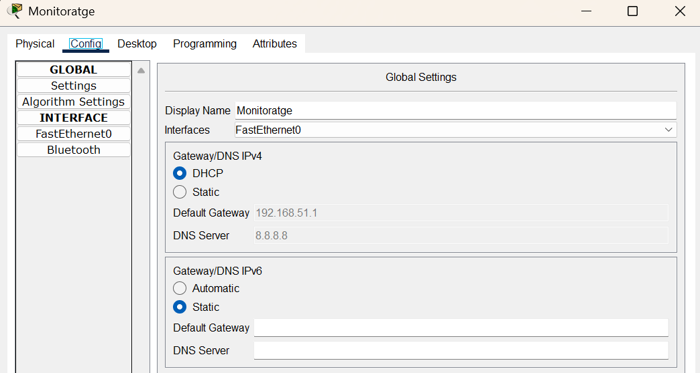
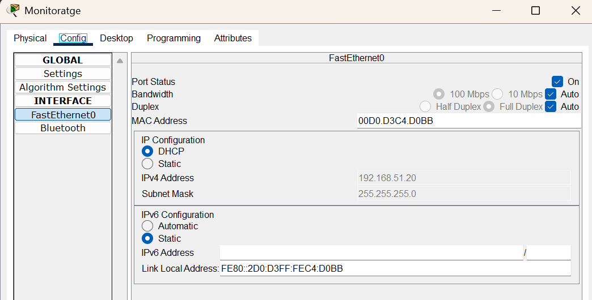
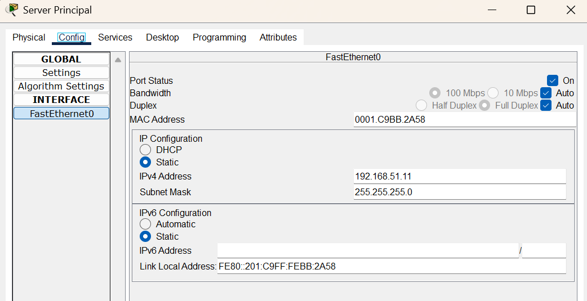
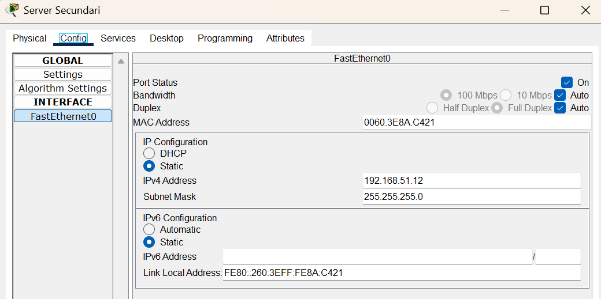

# Router


**Hostname**
```bash
Router> enable
Router# configure terminal
Enter configuration commands, one per line.  End with CNTL/Z.
Router(config)# hostname router-refereezy
```

### Sortida a internet

1. **Configuració NAT per establir connexió amb Internet**:
```bash=cisco
Router> enable
Router# conf t
Router(config)# interface gigabitEthernet 0/2

Router(config-if)# ip address dhcp
Router(config-if)# no shutdown
Router(config-if)# exit

Router(config)# ip nat inside source list 1 interface gigabitEthernet 0/2 overload
Router(config)# access-list 1 permit 192.168.1.0 0.0.0.255
```


## Xarxa LAN

1. Afegim una IP de la xarxa 192.168.51.0/24:
```bash=cisco
router-refereezy(config)# 
    interface gigabitEthernet 0/0
    ip address 192.168.51.1 255.255.255.0
    no shutdown
```

2. **Servidor DHCP en el Router**:
   ```bash
   ip dhcp excluded-address 192.168.51.1 192.168.51.19
   ip dhcp pool LAN
   network 192.168.51.0 255.255.255.0
   default-router 192.168.51.1
   dns-server 8.8.8.8
   exit
   ```


# Switch

Switch>enable
Switch#configure terminal
Enter configuration commands, one per line.  End with CNTL/Z.
Switch(config)#hostname switch-refereezy
switch-refereezy(config)#


# Monitoratge




# Server Principal




# Server Secundari


